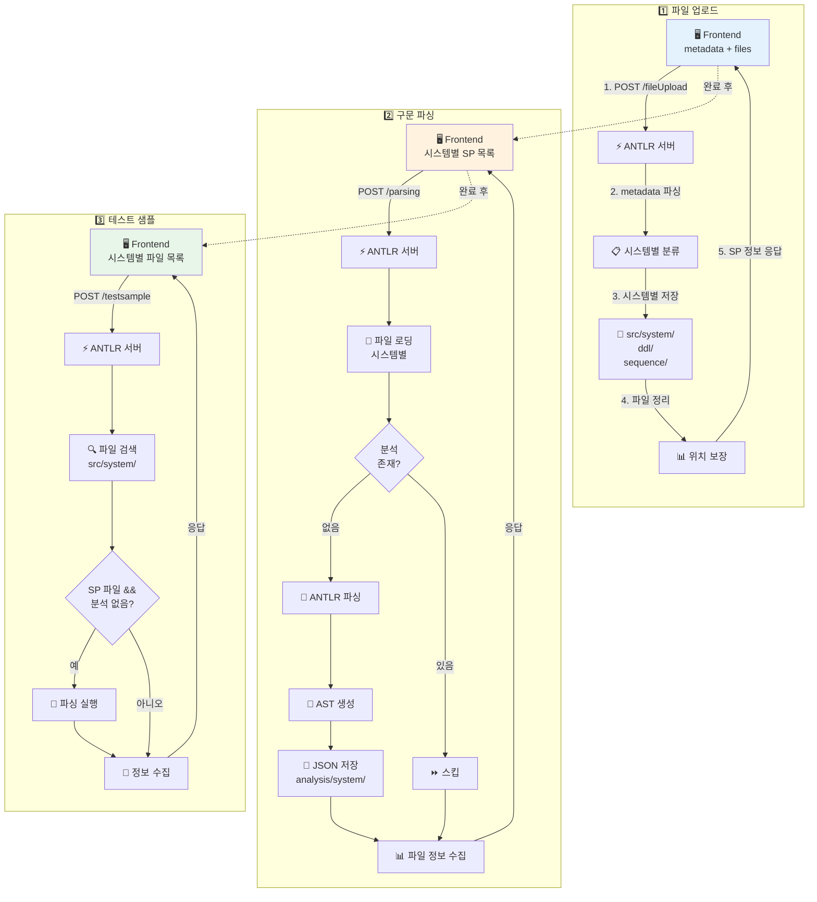
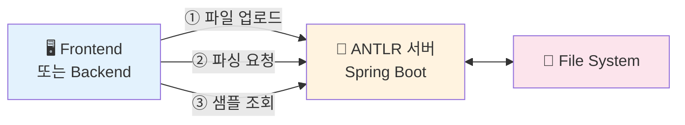

# 🔧 ANTLR Parser Server

> **PL/SQL 코드를 ANTLR로 파싱하여 AST(추상 구문 트리)를 JSON으로 생성하는 서비스**

[](https://spring.io/projects/spring-boot)
[](https://www.oracle.com/java/)
[](https://www.antlr.org/)
[](https://maven.apache.org/)

---

## 📋 목차

- [프로젝트 소개](#-프로젝트-소개)
- [핵심 기능](#-핵심-기능)
- [동작 원리](#-동작-원리)
- [시스템 아키텍처](#-시스템-아키텍처)
- [시작하기](#-시작하기)
- [API 가이드](#-api-가이드)
- [데이터 구조](#-데이터-구조)
- [디렉터리 구조](#-디렉터리-구조)
- [테스트](#-테스트)
- [문제해결](#-문제해결)

---

## 🎯 프로젝트 소개

ANTLR Parser Server는 **PL/SQL 코드를 문법에 맞게 파싱하여 구조화된 트리를 생성**하는 Spring Boot 기반 서비스입니다.

### 🤔 왜 이 프로젝트가 필요한가요?

PL/SQL 코드를 분석하고 변환하기 위해서는 먼저 **코드의 구조를 정확히 파악**해야 합니다. 하지만 수작업으로 코드 구조를 분석하는 것은 매우 어렵고 오류가 발생하기 쉽습니다.

**기존 방식의 문제점:**
- 👨‍💻 수작업 분석: 코드 구조 파악에 많은 시간 소요
- ❌ 높은 오류율: 복잡한 중첩 구조 파악 어려움
- 📉 일관성 부족: 분석 기준이 일정하지 않음
- 🔄 재사용 불가: 분석 결과를 다른 도구에서 활용하기 어려움

**ANTLR Parser Server의 해결책:**
- ⚡ 자동 파싱: 몇 초 내에 정확한 구문 트리 생성
- 🎯 정확한 분석: ANTLR 문법 기반의 정확한 파싱
- 💡 일관된 품질: 표준화된 JSON 형식으로 출력
- 📊 구조화: 라인 번호와 구문 타입이 포함된 트리 구조

---

## ✨ 핵심 기능

### 1️⃣ **파일 업로드 (File Upload)**
- PL/SQL 파일(`.sql`)을 세션별로 안전하게 저장
- 파일명 기반 자동 분류 (PL/SQL, DDL, Sequence)
- 다중 파일 동시 업로드 지원
- 자동 인코딩 감지 (UTF-8, EUC-KR, MS949)

### 2️⃣ **구문 파싱 (Parsing)**
- ANTLR 기반 정확한 PL/SQL 파싱
- AST(추상 구문 트리) 생성
- 구문 노드별 시작/종료 라인 추출
- JSON 형식으로 결과 저장

### 3️⃣ **세션 관리 (Session Management)**
- 사용자별 독립적인 작업 공간
- 세션 UUID 기반 파일 격리
- 분석 결과 캐싱 및 재사용

### 4️⃣ **테스트 샘플 처리**
- 프로시저명으로 파일 자동 검색
- 분석 결과 자동 확인 및 생성
- 대소문자 무시 검색

---

## 🔍 동작 원리

ANTLR Parser Server는 크게 **3단계**로 동작합니다:

### 📤 1단계: 파일 업로드 (File Upload)

```
Frontend → ANTLR 서버 → 파일 저장 → 응답
```

**무엇을 하나요?**
1. 🖥️ **파일 수신**: Frontend에서 PL/SQL 파일 업로드 (multipart/form-data)
2. 📁 **메타데이터 파싱**: 시스템별 파일 목록, DDL, Sequence 정보 추출
3. 💾 **파일 저장**: 
   - SP 파일: `data/{session}/{project}/src/{system}/` 디렉터리에 저장
   - DDL 파일: `data/{session}/{project}/ddl/` 디렉터리에 저장
   - Sequence 파일: `data/{session}/{project}/sequence/` 디렉터리에 저장
4. 🔍 **인코딩 감지**: UTF-8 → EUC-KR → MS949 순으로 시도
5. 📊 **파일 정리**: DDL/Sequence 파일을 최상위 디렉터리로 이동 보장
6. ✅ **완료 응답**: SP 파일 정보 반환 (파일명, 경로, 내용 포함)

**⚠️ 중요:**
- 응답에는 SP 파일 정보만 포함 (DDL/Sequence 제외)
- 모든 파일 처리 API는 `Session-UUID` 헤더 필수

### 🔍 2단계: 구문 파싱 (Parsing)

```
Frontend → ANTLR 서버 → 파일 읽기 → ANTLR 파싱 → AST 생성 → JSON 저장
```

**무엇을 하나요?**
1. 📤 **파싱 요청**: Frontend가 시스템별 SP 파일 목록과 함께 요청
2. 📂 **파일 로딩**: 저장된 PL/SQL 파일 읽기 (SP만 대상)
3. ✅ **분석 확인**: 이미 분석된 파일은 스킵
4. 🔧 **Lexer 실행**: `PlSqlLexer`가 토큰 스트림 생성
5. 🌳 **Parser 실행**: `PlSqlParser`가 구문 트리 생성
6. 👂 **Listener 순회**: `CustomPlSqlListener`가 트리 순회하며 노드 수집
7. 📊 **AST 구성**: 구문 타입과 라인 번호가 포함된 트리 구조 생성
8. 💾 **JSON 저장**: `analysis/{system}/{파일명}.json`에 결과 저장
9. ✅ **완료 응답**: 시스템별 파일 정보 반환 (객체명, 내용, 분석 상태 포함)

**왜 AST가 필요한가요?**

AST(추상 구문 트리)는 코드의 문법 구조를 계층적으로 표현한 것입니다. 
이를 통해 **코드 분석 도구**가 각 구문의 위치와 관계를 정확히 파악하여, 
의미 분석이나 코드 변환을 수행할 수 있습니다.

### 📝 3단계: 테스트 샘플 처리 (Test Sample)

```
Frontend → ANTLR 서버 → 시스템별 파일 검색 → 분석 확인/실행 → 결과 반환
```

**무엇을 하나요?**
1. 📤 **업로드 요청**: Frontend가 시스템별 파일 목록 전송
2. 🔍 **파일 검색**: `src/{system}/` 디렉터리에서 파일 검색
3. 📊 **분석 확인**: `analysis/{system}/` 디렉터리에서 JSON 파일 존재 확인
4. 🔧 **분석 실행**: SP 파일이고 분석 결과가 없으면 즉시 파싱 수행
5. 📄 **정보 수집**: 파일 내용, 객체명, 타입, 분석 존재 여부 등 수집
6. ✅ **결과 반환**: 시스템별 파일 정보와 분석 상태 반환

---

## 🏗️ 시스템 아키텍처

### 전체 흐름도



### 외부 서비스 연동



**각 구성 요소 역할:**

| 구성 요소 | 역할 | 기술 스택 |
|---------|------|----------|
| 🖥️ **Frontend** | 사용자 인터페이스, 파일 업로드, API 요청 | React/Vue 등 |
| 🔧 **ANTLR 서버** | PL/SQL 파싱, AST JSON 생성 | Spring Boot 3.3.0 + ANTLR 4.13.1 |
| 📁 **File System** | 파일 저장소 (원본 코드, AST JSON) | 로컬 디스크 |

**주요 데이터 흐름:**
- **① 업로드**: Frontend → ANTLR ↔ File System (파일 저장)
- **② 파싱**: Frontend → ANTLR ↔ File System (파일 읽기 → AST 저장)
- **③ 샘플**: Frontend → ANTLR ↔ File System (파일 검색 및 분석)

---

## 🚀 시작하기

### 📋 사전 요구사항

시작하기 전에 다음 항목들이 설치되어 있어야 합니다:

- ✅ **Java 17 이상**
- ✅ **Maven 3.8 이상**
- ✅ **Git**

### 📥 1단계: 저장소 클론

```bash
git clone <repository-url>
cd Antlr-Server
```

### 📦 2단계: 의존성 설치

**방법: 시스템 Maven 사용**
```bash
mvn clean install
```

### 🎬 4단계: 서버 실행

```bash
mvn spring-boot:run
```
---

## 📡 API 가이드

### 공통 헤더

모든 파일 처리 API 요청에는 다음 헤더가 필요합니다:

| 헤더 | 필수 | 설명 | 예시 |
|-----|------|------|------|
| `Session-UUID` | ✅ | 세션 식별자 (사용자별 고유 ID) | `user-session-12345` |

---

### 🏥 API 0: 헬스체크

**엔드포인트:** `GET /`

**역할:** 서버 상태 확인

**요청 예시:**

```bash
curl -i http://localhost:8081/
```

**응답:**
```
HTTP/1.1 200 OK
Content-Type: text/plain

OK
```

---

### 📤 API 1: 파일 업로드

**엔드포인트:** `POST /fileUpload`

**역할:** PL/SQL 파일을 시스템별로 서버에 업로드합니다.

**요청 예시:**

```bash
curl -X POST "http://localhost:8081/fileUpload" \
  -H "Session-UUID: my-session-123" \
  -F 'metadata={
    "dbms": "oracle",
    "projectName": "MyProject",
    "systems": [
      {"name": "SystemA", "sp": ["PROC_A.sql", "FUNC_A.sql"]},
      {"name": "SystemB", "sp": ["PROC_B.sql"]}
    ],
    "ddl": ["DDL_TABLES.sql", "DDL_VIEWS.sql"],
    "sequence": ["SEQ_ID.sql"]
  }' \
  -F "files=@/path/to/PROC_A.sql" \
  -F "files=@/path/to/FUNC_A.sql" \
  -F "files=@/path/to/PROC_B.sql" \
  -F "files=@/path/to/DDL_TABLES.sql" \
  -F "files=@/path/to/DDL_VIEWS.sql" \
  -F "files=@/path/to/SEQ_ID.sql"
```

**요청 파라미터:**

| 파라미터 | 타입 | 필수 | 설명 |
|---------|------|------|------|
| `metadata` | JSON String | ✅ | 업로드 메타데이터 (아래 참조) |
| `files` | MultipartFile[] | ✅ | 업로드할 파일 배열 |

**metadata 구조:**

```json
{
  "dbms": "oracle",
  "projectName": "MyProject",
  "systems": [
    {"name": "SystemA", "sp": ["파일명1.sql", "파일명2.sql"]},
    {"name": "SystemB", "sp": ["파일명3.sql"]}
  ],
  "ddl": ["DDL_파일명.sql"],
  "sequence": ["SEQ_파일명.sql"]
}
```

**응답 형식 (성공):**

```json
{
  "dbms": "oracle",
  "successFiles": [
    {
      "fileName": "PROC_A.sql",
      "filePath": "/path/to/data/session/project/src/SystemA/PROC_A.sql",
      "fileContent": "CREATE OR REPLACE PROCEDURE PROC_A..."
    },
    {
      "fileName": "FUNC_A.sql",
      "filePath": "/path/to/data/session/project/src/SystemA/FUNC_A.sql",
      "fileContent": "CREATE OR REPLACE FUNCTION FUNC_A..."
    }
  ]
}
```

**응답 형식 (일부 실패):**

```json
{
  "dbms": "oracle",
  "successFiles": [
    {
      "fileName": "PROC_A.sql",
      "filePath": "/path/to/...",
      "fileContent": "..."
    }
  ],
  "failedFiles": [
    {
      "fileName": "bad_file.sql",
      "error": "파일 업로드 및 저장 실패: IOException"
    }
  ]
}
```

**파일 저장 규칙:**

| 파일 분류 | 저장 디렉터리 | 비고 |
|-----------|-------------|------|
| systems.sp[] | `{BASE_DIR}/{session}/{project}/src/{system}/` | 시스템별 SP 파일 |
| ddl[] | `{BASE_DIR}/{session}/{project}/ddl/` | DDL 파일 |
| sequence[] | `{BASE_DIR}/{session}/{project}/sequence/` | Sequence 파일 |

---

### 🔍 API 2: 파일 파싱

**엔드포인트:** `POST /parsing`

**역할:** 업로드된 SP 파일을 시스템별로 ANTLR 파싱하여 AST JSON을 생성합니다.

**요청 예시:**

```bash
curl -X POST "http://localhost:8081/parsing" \
  -H "Content-Type: application/json" \
  -H "Session-UUID: my-session-123" \
  -d '{
    "dbms": "oracle",
    "projectName": "MyProject",
    "systems": [
      {"name": "SystemA", "sp": ["PROC_A.sql", "FUNC_A.sql"]},
      {"name": "SystemB", "sp": ["PROC_B.sql"]}
    ]
  }'
```

**요청 바디:**

```json
{
  "dbms": "oracle",
  "projectName": "MyProject",
  "systems": [
    {"name": "시스템명1", "sp": ["파일명1.sql", "파일명2.sql"]},
    {"name": "시스템명2", "sp": ["파일명3.sql"]}
  ]
}
```

**응답 형식 (성공):**

```json
{
  "dbms": "oracle",
  "successFiles": [
    {
      "system": "SystemA",
      "fileName": "PROC_A.sql",
      "objectName": "PROC_A",
      "fileContent": "CREATE OR REPLACE PROCEDURE PROC_A...",
      "fileType": "PLSQL",
      "analysisExists": "true"
    },
    {
      "system": "SystemA",
      "fileName": "FUNC_A.sql",
      "objectName": "FUNC_A",
      "fileContent": "CREATE OR REPLACE FUNCTION FUNC_A...",
      "fileType": "PLSQL",
      "analysisExists": "true"
    }
  ]
}
```

**응답 형식 (일부 실패):**

```json
{
  "dbms": "oracle",
  "successFiles": [
    {
      "system": "SystemA",
      "fileName": "PROC_A.sql",
      "objectName": "PROC_A",
      "fileContent": "...",
      "fileType": "PLSQL",
      "analysisExists": "true"
    }
  ],
  "failedFiles": [
    {
      "system": "SystemB",
      "fileName": "bad_file.sql",
      "error": "파일을 찾을 수 없습니다"
    }
  ]
}
```

**생성되는 파일:**

파싱이 성공하면 다음 위치에 JSON 파일이 생성됩니다:
```
{BASE_DIR}/{session}/{project}/analysis/{system}/{파일명}.json
```

예: `SystemA/PROC_A.sql` → `analysis/SystemA/PROC_A.json`

**참고:**
- 이미 분석된 파일은 자동으로 스킵되어 재분석하지 않습니다
- SP 파일만 분석 대상이며, DDL/Sequence 파일은 제외됩니다

---

### 📝 API 3: 테스트 샘플 처리

**엔드포인트:** `POST /testsample`

**역할:** 시스템별 파일을 검색하고, 분석 결과가 없으면 자동으로 파싱을 수행합니다.

**요청 예시:**

```bash
curl -X POST "http://localhost:8081/testsample" \
  -H "Content-Type: application/json" \
  -H "Session-UUID: my-session-123" \
  -d '{
    "dbms": "oracle",
    "projectName": "MyProject",
    "systems": [
      {"name": "SystemA", "sp": ["PROC_A.sql", "FUNC_A.sql"]},
      {"name": "SystemB", "sp": ["PROC_B.sql"]}
    ]
  }'
```

**요청 바디:**

```json
{
  "dbms": "oracle",
  "projectName": "MyProject",
  "systems": [
    {"name": "시스템명1", "sp": ["파일명1.sql", "파일명2.sql"]},
    {"name": "시스템명2", "sp": ["파일명3.sql"]}
  ]
}
```

**응답 형식:**

```json
{
  "dbms": "oracle",
  "successFiles": [
    {
      "system": "SystemA",
      "fileName": "PROC_A.sql",
      "objectName": "PROC_A",
      "fileContent": "CREATE OR REPLACE PROCEDURE PROC_A...",
      "fileType": "PLSQL",
      "analysisExists": "true"
    },
    {
      "system": "SystemA",
      "fileName": "FUNC_A.sql",
      "objectName": "FUNC_A",
      "fileContent": "CREATE OR REPLACE FUNCTION FUNC_A...",
      "fileType": "PLSQL",
      "analysisExists": "false"
    }
  ]
}
```

**응답 필드 설명:**

| 필드 | 타입 | 설명 |
|-----|------|------|
| `system` | String | 시스템명 |
| `fileName` | String | 실제 파일명 |
| `objectName` | String | 추출된 SQL 객체 이름 |
| `fileContent` | String | 파일 전체 내용 |
| `fileType` | String | 파일 타입 (PLSQL/DDL/SEQ) |
| `analysisExists` | String | 분석 결과 존재 여부 ("true"/"false") |

**동작 방식:**

1. `src/{system}/` 디렉터리에서 파일 검색
2. `analysis/{system}/{파일명}.json` 파일 존재 확인
3. SP 파일이고 분석 결과가 없으면 즉시 파싱 수행
4. 파일 정보와 분석 상태 반환

---

## 📁 데이터 구조

### 세션별 파일 레이아웃

```
BASE_DIR/  (프로젝트 상위/data 또는 DOCKER_COMPOSE_CONTEXT)
└── {Session-UUID}/              # 세션별 작업 공간
    └── {ProjectName}/           # 프로젝트별 공간
        ├── src/                 # SP 파일 (시스템별 하위 구조)
        │   ├── {System1}/
        │   │   └── *.sql
        │   └── {System2}/
        │       └── *.sql
        ├── ddl/                 # DDL 파일
        │   └── *.sql
        ├── sequence/            # Sequence 파일
        │   └── *.sql
        └── analysis/            # ANTLR 파싱 결과 (시스템별 하위 구조)
            ├── {System1}/
            │   └── *.json
            └── {System2}/
                └── *.json
```

### AST JSON 구조

파싱 결과로 생성되는 JSON은 다음과 같은 트리 구조를 가집니다:

```json
{
  "type": "ROOT",
  "startLine": 0,
  "endLine": 0,
  "children": [

    {
      "type": "PROCEDURE",
      "startLine": 1,
      "endLine": 50,
      "children": [
        {
          "type": "SPEC",
          "startLine": 1,
          "endLine": 5,
          "children": []
        },
        {
          "type": "SELECT",
          "startLine": 10,
          "endLine": 15,
          "children": []
        },
        {
          "type": "INSERT",
          "startLine": 20,
          "endLine": 25,
          "children": []
        },
        {
          "type": "IF",
          "startLine": 30,
          "endLine": 40,
          "children": [
            {
              "type": "UPDATE",
              "startLine": 32,
              "endLine": 35,
              "children": []
            }
          ]
        },
        {
          "type": "EXCEPTION",
          "startLine": 45,
          "endLine": 48,
          "children": []
        }
      ]
    }
  ]
}
```


**노드 구조:**

| 필드 | 타입 | 설명 |
|-----|------|------|
| `type` | String | 구문 타입 (PROCEDURE/FUNCTION/SELECT/INSERT 등) |
| `startLine` | Integer | 구문 시작 라인 번호 (1-based) |
| `endLine` | Integer | 구문 종료 라인 번호 (1-based) |
| `children` | Array | 하위 구문 노드 배열 |

**지원하는 주요 구문 타입:**

- `PROCEDURE` - 프로시저
- `FUNCTION` - 함수
- `PACKAGE` - 패키지
- `SPEC` - 파라미터 선언부
- `DECLARE` - 변수 선언부
- `SELECT` - SELECT 구문
- `INSERT` - INSERT 구문
- `UPDATE` - UPDATE 구문
- `DELETE` - DELETE 구문
- `MERGE` - MERGE 구문
- `IF` - IF 조건문
- `LOOP` - LOOP 반복문
- `EXCEPTION` - 예외 처리

---

## 📂 디렉터리 구조

```
Antlr-Server/
├── 📄 pom.xml                           # Maven 프로젝트 설정
├── 📄 README.md                         # 프로젝트 문서 (이 파일)
├── 📄 Dockerfile                        # Docker 이미지 빌드 설정
├── 📄 docker-compose.yml                # Docker Compose 설정
│
├── 📁 src/
│   ├── 📁 main/
│   │   ├── 📁 java/legacymodernizer/parser/
│   │   │   ├── 📄 ParserApplication.java           # Spring Boot 메인 클래스
│   │   │   │
│   │   │   ├── 📁 controller/                      # API 컨트롤러
│   │   │   │   ├── HealthCheckController.java      # 헬스체크 API
│   │   │   │   └── FileUploadController.java       # 파일 업로드/파싱/샘플 API
│   │   │   │
│   │   │   ├── 📁 service/                         # 비즈니스 로직
│   │   │   │   └── PlSqlFileParserService.java     # 파일 저장/파싱/객체명 추출
│   │   │   │
│   │   │   ├── 📁 antlr/                           # ANTLR 관련 클래스
│   │   │   │   ├── CustomPlSqlListener.java        # 구문 트리 리스너
│   │   │   │   ├── Node.java                       # AST 노드 클래스
│   │   │   │   ├── CaseChangingCharStream.java     # 대소문자 변환 스트림
│   │   │   │   └── plsql/                          # ANTLR 생성 파일
│   │   │   │       ├── PlSqlLexer.java
│   │   │   │       ├── PlSqlParser.java
│   │   │   │       └── PlSqlParserListener.java
│   │   │   │
│   │   │   └── 📁 config/                          # 설정 클래스
│   │   │       └── WebConfig.java                  # CORS 설정
│   │   │
│   │   └── 📁 resources/
│   │       └── 📄 application.properties            # 애플리케이션 설정
│   │
│   └── 📁 test/
│       └── 📁 java/legacymodernizer/parser/
│           └── AntlrAnalysisTest.java               # 파싱 테스트
│
└── 📁 target/                                       # 빌드 산출물
    ├── parser-0.0.1-SNAPSHOT.jar                    # 실행 가능한 JAR
    └── classes/                                     # 컴파일된 클래스
```

### 주요 모듈 설명

#### 📡 `controller/FileUploadController.java`
API 엔드포인트를 정의하고 요청을 처리합니다.

**주요 메서드:**
- `fileUpload()`: `/fileUpload` - 시스템별 파일 업로드 처리 (multipart/form-data)
- `analysisContext()`: `/parsing` - 시스템별 SP 파싱 실행
- `testSample()`: `/testsample` - 시스템별 샘플 조회 및 파싱
- `resolveUploaded()`: 업로드된 파일 맵에서 파일 검색
- `saveToBucketAndMaybeRespond()`: 지정 버킷에 파일 저장
- `saveSimpleBucketList()`: DDL/Sequence 버킷 리스트 저장
- `analyzeSystems()`: 시스템별 파일 분석 실행

#### ⚙️ `service/PlSqlFileParserService.java`
파일 저장, 파싱, 객체명 추출의 핵심 로직을 구현합니다.

**주요 메서드:**
- `saveBytesToBucket()`: 지정 버킷(src/ddl/sequence)에 파일 바이트 저장
- `parseAndSaveStructure()`: ANTLR 파싱 및 시스템별 JSON 저장
- `analyzeSpIfNeeded()`: SP 파일만 분석, 이미 분석된 경우 스킵
- `getFileInfoByName()`: 파일명으로 정보 조회 (내용, 객체명, 분석 상태)
- `ensureFileInTopLevelDir()`: DDL/Sequence 파일 위치 보장
- `readFileContent()`: 다중 인코딩 자동 감지 읽기
- `extractSqlObjectName()`: 정규식 기반 객체명 추출
- `getProjectRootDirectory()`: 프로젝트 루트 디렉터리 경로 반환
- `getAnalysisDirectory()`: 시스템별 분석 디렉터리 경로 반환
- `detectSystemNameForFile()`: 파일 경로에서 시스템명 추출
- `analysisExists()`: 분석 결과 JSON 파일 존재 여부 확인

#### 🎧 `antlr/CustomPlSqlListener.java`
ANTLR 파스 트리를 순회하며 AST 노드를 수집합니다.

**주요 기능:**
- 구문별 `enter*` / `exit*` 메서드 구현
- 중첩 구조 관리 (스택 기반)
- 라인 번호 추적

#### 📦 `antlr/Node.java`
AST 노드를 표현하는 데이터 클래스입니다.

**주요 속성:**
- `type`: 구문 타입
- `startLine`: 시작 라인
- `endLine`: 종료 라인
- `children`: 하위 노드 목록

**주요 메서드:**
- `toJson()`: JSON 문자열로 직렬화

---

## 🧪 테스트

### 테스트 시 필요한 것

**1. 테스트 데이터 위치:**
```
{BASE_DIR}/TestSession_5/src/
├── PRC_GEN_EQUIPMENTS_DAM.sql
├── YOUR_PROCEDURE.sql
└── YOUR_PACKAGE.sql
```

**2. 지원 파일 확장자:** `.sql`, `.plsql`, `.pls`, `.pck`, `.txt`

**3. 테스트 세션:** `TestSession_5` (고정)

### 테스트 함수 설명

#### `testAnalysisWithExistingFiles()`
- `src/` 폴더의 모든 SQL 파일을 자동 스캔하여 파싱
- `analysis/` 폴더에 JSON 결과 생성 확인
- 테스트 전 `analysis/` 폴더 자동 정리

#### `testSqlObjectNameExtraction()`
- 정규식 기반 객체명 추출 로직 검증
- 5가지 패턴 테스트 (PROCEDURE, FUNCTION, PACKAGE 등)
- 스키마 접두사 자동 제거 확인

#### `testRealFileObjectNameExtraction()`
- 실제 파일에서 객체명 추출 테스트
- `PRC_GEN_EQUIPMENTS_DAM.sql` 특별 검증

---

## 🛠️ 수정/확장 가이드

### 새 구문 타입 추가

`CustomPlSqlListener.java`에서 새로운 구문 타입을 인식하도록 확장할 수 있습니다:

```java
@Override
public void enterMerge_statement(PlSqlParser.Merge_statementContext ctx) {
    enterStatement("MERGE", ctx.getStart().getLine());
}

@Override
public void exitMerge_statement(PlSqlParser.Merge_statementContext ctx) {
    exitStatement("MERGE", ctx.getStop().getLine());
}
```

### 파일 크기 제한 변경

`application.properties`에서 업로드 크기 제한을 수정할 수 있습니다:

```properties
spring.servlet.multipart.max-file-size=10MB
spring.servlet.multipart.max-request-size=10MB
```
---

## 📞 지원

문제가 발생하거나 질문이 있으시면 이슈를 생성해 주세요.

---

## 📄 라이선스

내부 프로젝트 용도(사내 배포). 별도 라이선스 고지 없으면 본 저장소 외부 배포 금지.


---

<div align="center">

**Made with ❤️ by Legacy Modernizer Team**

⭐ 이 프로젝트가 유용하다면 Star를 눌러주세요!

</div>
