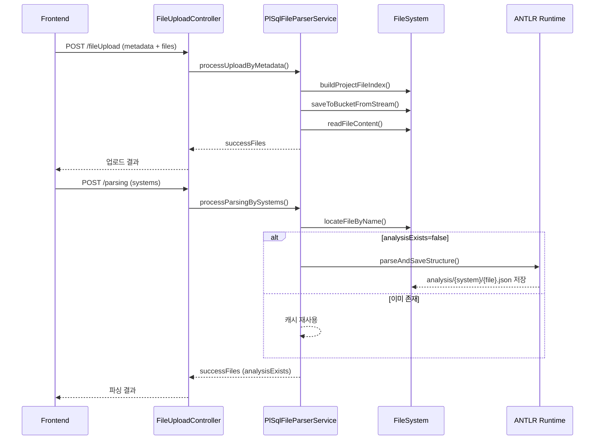

# Legacy Modernizer ANTLR Server - Parsing 파이프라인 완벽 가이드

> **PL/SQL 파일을 세션 단위로 수집하고 ANTLR로 파싱하여 AST JSON을 제공하는 Spring Boot 기반 백엔드**
>
> 이 문서는 새로 합류한 개발자가 프로젝트의 전체 구조와 실제 동작 원리를 빠르게 이해하고,
> 필요한 수정 지점을 즉시 파악할 수 있도록 작성되었습니다.

[](https://spring.io/projects/spring-boot)
[](https://www.oracle.com/java/)
[](https://www.antlr.org/)
[](https://maven.apache.org/)

---

## 목차

1. [프로젝트 개요](#1-프로젝트-개요)
2. [시스템 아키텍처](#2-시스템-아키텍처)
3. [데이터 저장 구조와 AST JSON](#3-데이터-저장-구조와-ast-json)
4. [Parsing 파이프라인 완벽 가이드](#4-parsing-파이프라인-완벽-가이드)
5. [시퀀스 다이어그램](#5-시퀀스-다이어그램)
6. [파일별 상세 가이드](#6-파일별-상세-가이드)
7. [개발 환경 설정](#7-개발-환경-설정)
8. [API 테스트 가이드](#8-api-테스트-가이드)
9. [검증 & 테스트 전략](#9-검증--테스트-전략)
10. [운영 및 모니터링 메모](#10-운영-및-모니터링-메모)
11. [트러블슈팅](#11-트러블슈팅)
12. [FAQ & 다음 단계](#12-faq--다음-단계)
13. [참고 자료](#13-참고-자료)

---

## 1. 프로젝트 개요

### 1.1 Legacy Modernizer ANTLR Server란?

Legacy Modernizer 플랫폼의 첫 번째 게이트웨이로, **원본 PL/SQL 자산을 세션 기반 디렉터리에 안전하게 저장하고 ANTLR 4 파서를 통해 AST JSON을 생성**합니다. 생성된 JSON은 Understanding/Converting 단계에서 재활용되는 단일 소스이며, 재파싱 없이 반복 조회가 가능합니다.

### 1.2 핵심 철학

```text
┌───────────────────────────────────────────────────────────────┐
│  "AST를 빠르고 일관되게 제공해야 이후 단계가 안전해진다"        │
│                                                               │
│  업로드부터 파싱까지의 모든 과정을 자동화하고, 재사용 가능한       │
│  JSON 캐시를 제공해야 전체 현대화 파이프라인의 품질을 보장한다    │
└───────────────────────────────────────────────────────────────┘
```

### 1.3 플랫폼 내 역할

| 구분 | 입력 | 출력 | 역할 |
|------|------|------|------|
| **ANTLR Server** | PL/SQL 업로드 파일 + metadata | AST JSON + 파일 콘텐츠 | - 파일 저장/인덱싱<br/>- ANTLR 파싱<br/>- 분석 캐시 관리 |
| **Understanding Core (별도 서비스)** | AST JSON | Neo4j 그래프 | - 의미 분석<br/>- 호출/테이블 관계 구축 |
| **Converting Core (별도 서비스)** | Neo4j 그래프 | 타겟 코드 템플릿 | - 코드 생성<br/>- 구조 변환 |

> ⚠️ *이 문서는 ANTLR Server 범위만 다룹니다. Understanding/Converting은 다른 저장소에서 관리됩니다.*

---

## 2. 시스템 아키텍처

### 2.1 전체 구조

```text
┌────────────────────────────────────────────────────────────┐
│                   Legacy Modernizer Frontend               │
│  - 세션 UUID 생성 및 헤더 전달                              │
│  - 업로드 UI / 파싱 트리거                                  │
└───────────────┬───────────────────────────────────────────┘
                │ HTTP (REST)
┌───────────────▼───────────────────────────────────────────┐
│                 ANTLR Parser Server (Spring Boot)         │
│  ┌────────────────────────────────────────────────────┐   │
│  │ FileUploadController                               │   │
│  │  ├─ POST /fileUpload                               │   │
│  │  └─ POST /parsing                                  │   │
│  ├────────────────────────────────────────────────────┤   │
│  │ PlSqlFileParserService                             │   │
│  │  ├─ 파일 인덱싱/저장/읽기                           │   │
│  │  └─ ANTLR 파싱 및 JSON 저장                         │   │
│  └────────────────────────────────────────────────────┘   │
└───────────────┬───────────────────────────────────────────┘
                │ 로컬 파일 시스템 (세션별 디렉터리)
┌───────────────▼───────────────────────────────────────────┐
│       {BASE_DIR}/{Session-UUID}/{projectName}/             │
│        ├─ src/{system}/                                   │
│        ├─ ddl/                                            │
│        ├─ sequence/                                       │
│        └─ analysis/{system}/                              │
└────────────────────────────────────────────────────────────┘
```

### 2.2 내부 모듈 흐름

```text
Controller (FileUploadController)
   │
   ├─ PlSqlFileParserService.processUploadByMetadata()
   │      ├─ buildProjectFileIndex()
   │      ├─ saveToBucketFromStream()
   │      └─ readFileContent() + analysisExists()
   │
   └─ PlSqlFileParserService.processParsingBySystems()
          ├─ locateFileByName()
          ├─ analyzeSpIfNeeded() → parseAndSaveStructure()
          └─ CustomPlSqlListener → Node.toJson()
```

- `ParserStrategyFactory`는 DBMS 문자열을 정규화해 `DbmsParserStrategy` 구현체를 선택합니다.
- 기본 매핑: `oracle`/`plsql` → `PlSqlParserStrategy`, `postgres`/`postgresql`/`pg` → `PostgreSqlParserStrategy`.
- 각 전략은 `parseFile(File, String)`을 구현해 ANTLR 파서를 교체하며, 동일한 `PlSqlFileParserService` 파이프라인을 공유합니다.

### 2.3 주요 의존 요소

| 구성 요소 | 역할 | 세부 내용 |
|-----------|------|-----------|
| **Spring Boot 3.3.0** | REST API + DI | Controller/Service 구조 구성 |
| **Jakarta Servlet** | 헤더 추출 | `Session-UUID` 확인 |
| **Jackson** | JSON 파싱 | metadata 문자열 → Map |
| **ANTLR 4.13.1** | 파서 생성 | Lexer/Parser/Listener 실행 |
| **Lombok** | 보일러플레이트 제거 | `@RequiredArgsConstructor`, `@Slf4j` 등 |
| **Maven** | 빌드 도구 | `mvn clean install` 파이프라인 |

---

## 3. 데이터 저장 구조와 AST JSON

### 3.1 BASE_DIR 결정 규칙

| 우선순위 | 경로 결정 | 설명 |
|----------|-----------|------|
| 1 | `DOCKER_COMPOSE_CONTEXT` 환경 변수 | Docker 배포 환경에서 마운트된 볼륨 활용 |
| 2 | `<프로젝트 루트>/../data` | 로컬 개발 기본 경로 |

> `PlSqlFileParserService`의 `BASE_DIR` 상수에서 위 우선순위가 반영됩니다.

### 3.2 세션 디렉터리 레이아웃

```
{BASE_DIR}/
└── {Session-UUID}/
    └── {projectName}/
        ├── src/
        │   └── {systemName}/
        │       └── *.sql | *.pls | *.plsql | *.pck | *.txt
        ├── ddl/
        │   └── *.sql
        ├── sequence/
        │   └── *.sql
        └── analysis/
            └── {systemName}/
                └── *.json
```

- `src/{system}/` : 시스템별 저장 프로시저 원본 파일
- `analysis/{system}/` : 동일 시스템명으로 파싱 JSON 저장
- `ddl/`, `sequence/` : metadata에 명시된 기타 스크립트 저장소

### 3.3 AST JSON 기본 구조

`CustomPlSqlListener`가 작성하는 JSON은 `Node` 클래스가 담당하며, 아래 형태를 가집니다.

```json
{
  "type": "PROCEDURE",
  "startLine": 1,
  "endLine": 28,
  "children": [
    {
      "type": "SPEC",
      "startLine": 1,
      "endLine": 5,
      "children": []
    },
    {
      "type": "SELECT",
      "startLine": 10,
      "endLine": 15,
      "children": []
    },
    {
      "type": "INSERT",
      "startLine": 20,
      "endLine": 24,
      "children": []
    }
  ]
}
```

| 필드 | 설명 |
|------|------|
| `type` | 노드 타입 (PROCEDURE/SELECT/DECLARE 등) |
| `startLine`, `endLine` | 1-based 라인 범위 |
| `children` | 하위 노드 배열 |

### 3.4 주요 노드 타입 정리

| 타입 | 설명 |
|------|------|
| `PROCEDURE` | 프로시저/함수 본문 |
| `SPEC` | 파라미터 선언부 |
| `DECLARE` | 변수 선언부 |
| `SELECT`, `INSERT`, `UPDATE`, `DELETE` | DML 구문 |
| `IF`, `LOOP`, `EXCEPTION` | 제어 구문 |
| `PACKAGE_BODY`, `PACKAGE_SPEC` | 패키지 정의 (있는 경우) |

---

## 4. Parsing 파이프라인 완벽 가이드

### 4.1 전체 플로우 개요

```
[1] 업로드 요청 (POST /fileUpload)
     └─ metadata JSON 파싱 → 파일 인덱싱/저장 → 성공 파일 목록 응답
[2] 파싱 요청 (POST /parsing)
     └─ 파일 검색 → JSON 캐시 확인 → 필요 시 ANTLR 파싱 → 결과 응답
```

### 4.2 Step 1. 업로드 요청 수신

- **컨트롤러**: `FileUploadController.fileUpload(...)`
- **헤더**: `Session-UUID` (필수)
- **입력**: `metadata` (JSON 문자열), `files` (MultipartFile[])
- metadata 파싱 실패 시 `400 Bad Request`
- 세션 헤더 누락 시 `400 Bad Request`

```java
@PostMapping(value = "/fileUpload", consumes = MediaType.MULTIPART_FORM_DATA_VALUE)
public ResponseEntity<Map<String, Object>> fileUpload(
        @RequestPart("metadata") String metadata,
        @RequestPart("files") MultipartFile[] files,
        HttpServletRequest request) {
    String sessionUUID = request.getHeader("Session-UUID");
    if (sessionUUID == null || sessionUUID.isBlank()) {
        throw new ResponseStatusException(HttpStatus.BAD_REQUEST, "세션 정보가 없습니다");
    }
    Map<String, Object> meta = mapper.readValue(metadata, new TypeReference<>() {});
    ...
}
```

### 4.3 Step 2. 파일 인덱싱 & 저장 로직

#### 4.3.1 `buildProjectFileIndex`

- `src/` 디렉터리 재귀 탐색 + `ddl/`, `sequence/` 1-depth 탐색
- 소문자 파일명 → `File` 객체 Map 구성
- 업로드 이전에 이미 존재하는 파일 우선 반환

#### 4.3.2 `saveToBucketFromStream`

- 버킷(`src`/`ddl`/`sequence`) 기반으로 저장 경로 결정
- 시스템명이 있는 경우 `src/{system}/` 하위에 파일 생성
- 기존 파일이 있으면 덮어쓰기 (REPLACE_EXISTING)

#### 4.3.3 인코딩 감지 `readFileContent`

1. UTF-8 시도 → 실패 시
2. EUC-KR → 실패 시
3. MS949 → 마지막 시도

### 4.4 Step 3. 성공 응답 포맷

- 업로드 API는 `successFiles` 배열만 반환합니다.
- 배열 요소에는 `system`, `fileName`, `filePath`, `fileContent`, `analysisExists` 포함
- DDL/Sequence 파일은 응답에 포함되지 않습니다 (저장만 수행)

### 4.5 Step 4. 파싱 요청 처리

- **컨트롤러**: `FileUploadController.analysisContext(...)`
- systems 배열 유효성 검증 (없으면 400)
- 세션 헤더 필수

```java
@PostMapping("/parsing")
public ResponseEntity<Map<String, Object>> analysisContext(
        @RequestBody Map<String, Object> request,
        HttpServletRequest httpRequest) {
    String sessionUUID = httpRequest.getHeader("Session-UUID");
    if (sessionUUID == null || sessionUUID.isBlank()) {
        throw new ResponseStatusException(HttpStatus.BAD_REQUEST, "세션 정보가 없습니다");
    }
    ...
}
```

### 4.6 Step 5. 파일 검색 & 캐시 확인

- `locateFileByName` : 인덱스 기반 빠른 검색 → 실패 시 재귀 탐색
- `analysisExists` : `analysis/{system}/{파일명}.json` 존재 여부 확인
- 이미 분석된 파일은 재파싱하지 않고 `analysisExists=true`로 응답

### 4.7 Step 6. DBMS별 파싱 전략 선택

- `ParserStrategyFactory.getStrategy(dbms)`가 요청 본문의 `dbms` 값을 정규화하여 대응되는 `DbmsParserStrategy`를 반환합니다.
- 미지정 또는 빈 문자열이면 기본적으로 `plsql` 전략(`PlSqlParserStrategy`)을 사용합니다.
- 현재 매핑: `oracle`/`plsql` → `PlSqlParserStrategy`, `postgres`/`postgresql`/`pg` → `PostgreSqlParserStrategy`.
- 선택된 전략은 `processParsingBySystemsWithStrategy(...)`를 통해 `PlSqlFileParserService` 파이프라인에 주입되며, 전략별 `parseFile` 구현만 교체됩니다.

### 4.8 Step 7. ANTLR 파싱 실행

- `parseAndSaveStructure` 수행 시 흐름
  1. `CharStreams.fromStream()` → `CaseChangingCharStream`으로 대문자 변환 (Oracle 호환)
  2. `PlSqlLexer` → `CommonTokenStream`
  3. `PlSqlParser.sql_script()`로 파스 트리 생성
  4. `CustomPlSqlListener`가 트리를 순회하며 `Node` 구조 구성
  5. `Node.toJson()` 결과를 `{analysis}/{system}/{파일명}.json`에 저장

### 4.9 Step 8. 응답 및 에러 처리

- 모든 파일 처리 성공 시에만 `200 OK`
- 업로드/파싱 중 하나라도 실패하면 즉시 예외 발생 → `GlobalExceptionHandler`에서 `{"detail":"..."}` 반환
- 부분 성공 미지원

---

## 5. 시퀀스 다이어그램

### 5.1 업로드 + 파싱 전체 흐름



---

## 6. 파일별 상세 가이드

### 6.1 `ParserApplication.java`

- Spring Boot 진입점
- 별도 로직 없음 (SpringApplication.run 호출)

### 6.2 `controller/FileUploadController.java`

| 메서드 | 역할 | 비고 |
|--------|------|------|
| `fileUpload()` | 업로드 처리 | metadata 파싱, 파일 저장, 응답 구성 |
| `analysisContext()` | 파싱 처리 | 캐시 확인 후 필요 시 파싱 실행 |

- `Session-UUID` 헤더 필수 확인
- 모든 예외는 `ResponseStatusException`으로 래핑하여 글로벌 핸들러에 전달

### 6.3 `service/PlSqlFileParserService.java`

- 전체 비즈니스 로직 핵심
- 5개 섹션으로 구성
  1. **경로 유틸리티**: 디렉터리 결정, 시스템명 탐지
  2. **파일 I/O**: 저장/읽기/인코딩 감지
  3. **파싱 관련**: ANTLR 실행, JSON 존재 확인
  4. **업로드 처리**: metadata 기반 파일 처리 흐름
  5. **파일 검색**: 인덱싱, 재귀 탐색, 정보 조회

### 6.4 `antlr/*`

| 파일 | 설명 |
|------|------|
| `CaseChangingCharStream.java` | Lexer 입력을 대문자로 변환 |
| `CustomPlSqlListener.java` | 파스 트리를 순회하며 `Node` 구성 |
| `Node.java` | AST 노드 표현 및 `toJson()` 직렬화 |
| `plsql/` | ANTLR가 생성한 Lexer/Parser/Listener 파일 (수정 금지) |

### 6.5 `config/WebConfig.java`

- CORS 설정 (`http://localhost:8080` 허용)
- `GlobalExceptionHandler`
  - `ResponseStatusException` → HTTP 상태/메시지 변환
  - 기타 예외 → `500` + `"Unexpected error: ..."`
  - 모든 응답은 `detail` 단일 필드 유지

### 6.6 `src/main/resources/application.properties`

```
spring.application.name=parser
server.port=8081
spring.servlet.multipart.max-file-size=3MB
spring.servlet.multipart.max-request-size=3MB
logging.charset.console=MS949
logging.charset.file=UTF-8
```

---

## 7. 개발 환경 설정

### 7.1 필수 소프트웨어

| 항목 | 버전 | 확인 명령 |
|------|------|------------|
| JDK | 17 | `java -version` |
| Maven | 3.8+ | `mvn -v` |
| Git | 최신 | `git --version` |

### 7.2 설치 & 빌드 순서

```bash
git clone <repository-url>
cd Antlr-Server
mvn clean install
# 테스트 생략 시
mvn clean install -Dmaven.test.skip=true
```

### 7.3 실행 옵션

```bash
# 개발 모드 (소스 Hot Reload 없음)
mvn spring-boot:run

# 패키징 후 실행
mvn package
java -jar target/parser-0.0.1-SNAPSHOT.jar
```

- 서버 포트: `http://localhost:8081`
- 로그 인코딩: 콘솔 MS949, 파일 UTF-8 (Windows 환경 고려)

---

## 8. API 테스트 가이드

### 8.1 헬스체크

```bash
curl -i http://localhost:8081/
```

### 8.2 업로드 예제

> ℹ️ `dbms` 값에 따라 `ParserStrategyFactory`가 DBMS별 파싱 전략을 선택합니다. 기본값은 `plsql`이며, `oracle` 문자열도 동일 전략으로 매핑됩니다. PostgreSQL 파서를 사용하려면 `postgres`, `postgresql`, `pg` 중 하나를 지정하세요.

```bash
curl -X POST "http://localhost:8081/fileUpload" \
  -H "Session-UUID: demo-session" \
  -F 'metadata={
    "dbms": "plsql",
    "projectName": "DemoProject",
    "systems": [
      {"name": "SYSTEM_A", "sp": ["PROC_A.sql", "FUNC_A.sql"]}
    ],
    "ddl": ["DDL_TABLE.sql"],
    "sequence": ["SEQ_USER.sql"],
    "testmode": false
  }' \
  -F "files=@/path/to/PROC_A.sql" \
  -F "files=@/path/to/FUNC_A.sql" \
  -F "files=@/path/to/DDL_TABLE.sql" \
  -F "files=@/path/to/SEQ_USER.sql"
```

> `testmode=true` 또는 `testMode=true`이면 업로드 없이 기존 파일만 확인합니다.

### 8.3 파싱 요청 예제

```bash
curl -X POST "http://localhost:8081/parsing" \
  -H "Session-UUID: demo-session" \
  -H "Content-Type: application/json" \
  -d '{
        "dbms": "plsql",
        "projectName": "DemoProject",
        "systems": [
          {"name": "SYSTEM_A", "sp": ["PROC_A.sql", "FUNC_A.sql"]}
        ]
      }'
```

### 8.4 에러 응답 샘플

```http
HTTP/1.1 400 Bad Request
Content-Type: application/json

{"detail":"세션 정보가 없습니다"}
```

```http
HTTP/1.1 500 Internal Server Error
Content-Type: application/json

{"detail":"Unexpected error: 업로드 처리 실패: system=SYSTEM_A, file=PROC_A.sql - 파일이 존재하지 않으며 업로드 파일도 없습니다"}
```

---

## 9. 검증 & 테스트 전략

### 9.1 수동 검증 절차

1. `{BASE_DIR}/{Session-UUID}/{projectName}/src/{system}/`에 테스트용 SQL 파일을 준비합니다.
2. 서버를 실행한 뒤 `POST /fileUpload`를 호출하여 파일이 정상적으로 응답되는지 확인합니다.
3. 이어서 `POST /parsing`을 호출하면 `{analysis}/{system}/{파일명}.json`이 생성됩니다.
4. 생성된 JSON이 기대한 AST 구조인지 직접 열어 확인합니다.

### 9.2 IDE 실행 (권장)

- `src/test/java/legacymodernizer/parser/AntlrAnalysisTest.java`를 IDE에서 열고 **Run 버튼을 클릭**하여 실행합니다.
- 테스트는 하드코딩된 상수(`Session-UUID = TestSession`, `projectName = text2sql`, `dbms = plsql`)를 사용하므로, 실행 전에 아래 경로에 샘플 파일을 준비해야 합니다.
  ```
  {BASE_DIR}/TestSession/text2sql/src/{시스템명}/샘플.sql
  ```
- 테스트 시작 시 기존 `analysis/` 디렉터리를 자동으로 비워 캐시 영향 없이 파싱을 검증합니다.

### 9.3 CLI 실행 (선택)

IDE 환경이 준비되지 않은 경우에만 아래 명령으로 동일 테스트를 실행할 수 있습니다.
```bash
mvn -Dtest=AntlrAnalysisTest test
```
> 이때도 `{BASE_DIR}/TestSession/text2sql/src/` 경로에 최소 1개 이상의 SQL 파일이 존재해야 합니다.

### 9.4 테스트 커버리지 포인트

| 테스트 항목 | 내용 |
|-------------|------|
| 파일 검색 | 시스템 디렉터리 내 모든 SQL 스캔 |
| 파싱 실행 | ANTLR 파싱 + JSON 생성 |
| 결과 검증 | 생성된 JSON 존재 여부 및 비지 않음 확인 |

---

## 10. 참고 자료

- [ANTLR 4 공식 문서](https://github.com/antlr/antlr4)
- [Spring Boot 3.3 레퍼런스](https://docs.spring.io/spring-boot/docs/3.3.0/reference/html/)
- [Legacy Modernizer 플랫폼 개요](사내 위키)

---
