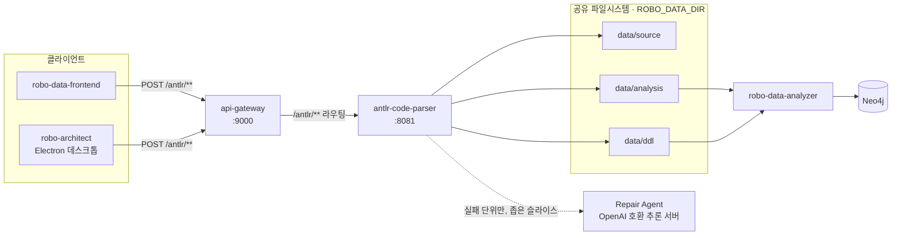
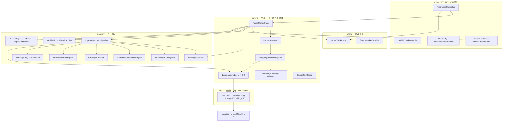
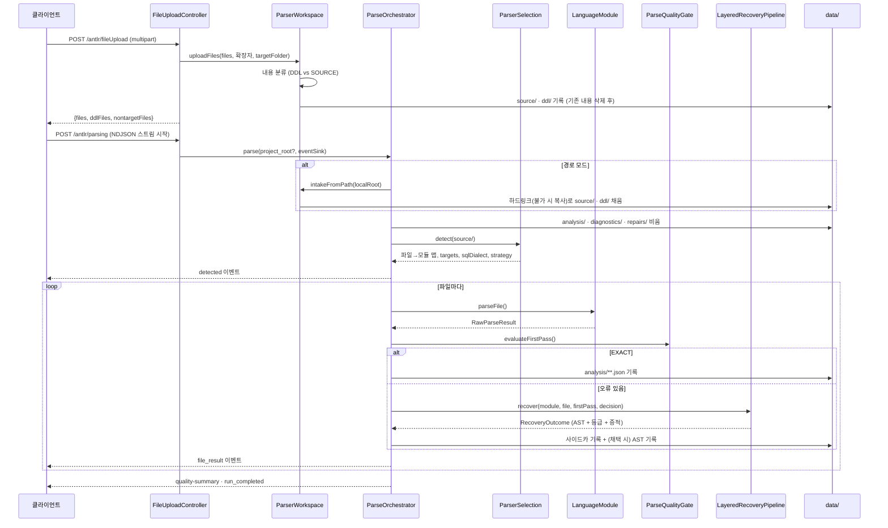
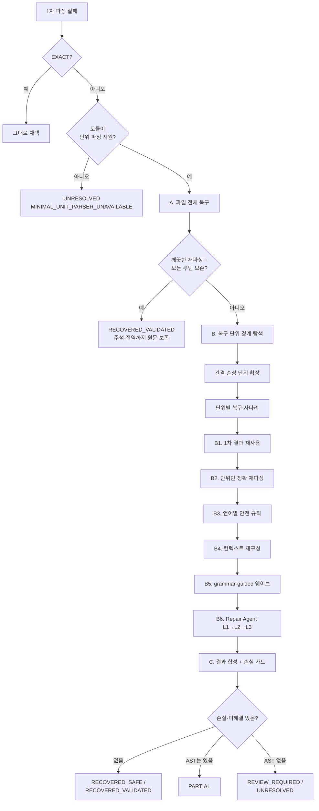

# ANTLR Code Parser

레거시 소스 코드(Java · C · Python · Oracle PL/SQL · PostgreSQL)를 수집해 **언어 중립 AST
JSON**으로 변환하는 Spring Boot 백엔드입니다. 호출자는 언어를 지정하지 않습니다 — 확장자와 파일
내용으로 파서를 자동 선택하고, 문법 오류가 있는 파일도 **계층적 복구 파이프라인**으로 최대한
구조를 살려낸 뒤 등급을 붙여 내보냅니다.

[](https://spring.io/projects/spring-boot)
[](https://www.oracle.com/java/)
[](https://www.antlr.org/)

---

## 목차

1. [무엇을 하는 서비스인가](#1-무엇을-하는-서비스인가)
2. [시스템 안에서의 위치](#2-시스템-안에서의-위치)
3. [설계 원칙](#3-설계-원칙)
4. [아키텍처](#4-아키텍처)
5. [End-to-End 파이프라인](#5-end-to-end-파이프라인)
6. [복구 파이프라인 상세](#6-복구-파이프라인-상세)
7. [품질 등급 체계](#7-품질-등급-체계)
8. [API](#8-api)
9. [데이터 계약](#9-데이터-계약)
10. [디스크 레이아웃과 산출물](#10-디스크-레이아웃과-산출물)
11. [언어 카탈로그](#11-언어-카탈로그)
12. [새 언어 추가](#12-새-언어-추가)
13. [프로젝트 구조](#13-프로젝트-구조)
14. [설정](#14-설정)
15. [실행](#15-실행)
16. [테스트](#16-테스트)
17. [문제 해결](#17-문제-해결)

---

## 1. 무엇을 하는 서비스인가

수십만 라인짜리 오래된 시스템을 분석하려면 먼저 **코드를 기계가 읽을 수 있는 구조로** 바꿔야
합니다. 이 서비스가 그 첫 단계를 담당합니다.

**입력** — 사용자가 업로드한 소스 파일들, 또는 데스크톱 앱이 지정한 로컬 폴더 경로
**출력** — `data/analysis/` 아래 소스와 동일한 폴더 구조로 미러링된 AST JSON 파일들 + 실시간
진행 스트림 + 파일별 진단·복구 증적

핵심 가치는 세 가지입니다.

| | 설명 |
|---|---|
| **언어 무지(agnostic) 입구** | 호출자가 `target=java` 같은 파라미터를 보내지 않습니다. 확장자로 1차 라우팅하고, `.sql`처럼 여러 언어가 공유하는 확장자는 파일 내용의 방언 마커 점수로 결정합니다. 한 프로젝트에 Java와 PL/SQL이 섞여 있어도 파일마다 알맞은 파서로 갑니다. |
| **깨진 코드도 포기하지 않음** | 레거시 소스는 컴파일되지 않는 상태로 넘어오는 일이 흔합니다. 문법 오류가 나면 결정론적 복구 → 언어별 안전 규칙 → 컨텍스트 재구성 → grammar-guided 편집 엔진 → LLM Repair Agent 순으로 시도하고, **재파싱으로 검증된 제안만** 채택합니다. |
| **정직한 등급** | 복구가 완전하지 않으면 `PARTIAL`·`REVIEW_REQUIRED`·`UNRESOLVED`로 정직하게 강등합니다. 내용이 유실됐는데 "복구 성공"으로 보고하지 않도록 라인 커버리지 손실 가드·구조 보존 검사·세탁 방지 규칙이 걸려 있습니다. |

동일한 `Node` 스키마를 모든 언어가 공유하므로, 하류 소비자(`robo-data-analyzer`)는 언어별 분기
없이 하나의 AST 형식만 다루면 됩니다.

---

## 2. 시스템 안에서의 위치


```mermaid
flowchart LR
    subgraph client[클라이언트]
        FE[robo-data-frontend]
        EL[robo-architect<br/>Electron 데스크톱]
    end

    GW[api-gateway<br/>:9000]
    P[antlr-code-parser<br/>:8081]
    AN[robo-data-analyzer]
    N4[(Neo4j)]

    subgraph fs[공유 파일시스템 · ROBO_DATA_DIR]
        SRC[data/source]
        DDL[data/ddl]
        AST[data/analysis]
    end

    GPU[Repair Agent<br/>OpenAI 호환 추론 서버]

    FE -->|POST /antlr/**| GW
    EL -->|POST /antlr/**| GW
    GW -->|/antlr/** 라우팅| P
    P --> SRC
    P --> DDL
    P --> AST
    P -.->|실패 단위만, 좁은 슬라이스| GPU
    AST --> AN
    DDL --> AN
    AN --> N4
```

- **상류** — `api-gateway`가 `/antlr/**` 경로를 이 서비스로 라우팅합니다. 웹 프론트엔드와
  Electron 데스크톱 모두 게이트웨이를 통해 접근합니다.
- **하류** — AST는 HTTP 응답이 아니라 **파일로** 전달됩니다. `robo-data-analyzer`가
  `data/analysis/`를 직접 읽어 지식 그래프 분석의 입력으로 씁니다. 두 서비스는 서로를 HTTP로
  호출하지 않으며, `ROBO_DATA_DIR`로 가리키는 공유 디렉터리가 유일한 접점입니다.
- **DDL 분기** — `.sql` 중 표 정의만 들어 있는 파일은 파싱 대상이 아니라 `data/ddl/`로 갑니다.
  Analyzer가 이쪽은 sqlglot 기반 DDL 파서로 따로 처리합니다.
- **외부 호출** — 이 서비스가 능동적으로 호출하는 외부 시스템은 Repair Agent 추론 서버 하나뿐
  입니다. 정상 파싱되는 파일에서는 한 번도 호출되지 않습니다.

---

## 3. 설계 원칙

이 저장소의 코드는 다음 규칙 위에서 작성돼 있습니다. 구조를 읽을 때 이 규칙들이 왜 그렇게 되어
있는지의 근거가 됩니다.

**① 분류는 경로가 아니라 내용으로 한다**
`ddl/` 폴더 접두는 역호환 힌트로만 쓰이고, 실제 판정은 파일 안에 무엇이 선언돼 있는지로
합니다. 프로시저가 표 정의 파서로 흘러가 run 전체가 죽는 사고를 구조적으로 차단합니다.

**② 입구는 하나로 수렴한다**
브라우저 업로드 모드와 로컬 경로 모드가 서로 다른 코드를 타지 않습니다. 두 모드 모두 먼저
`data/{source,ddl}`을 채우고, 그 뒤 파싱은 **항상 `data/source`만** 읽습니다.

**③ 복구는 검증된 것만 채택한다**
어떤 제안(안전 규칙·편집 엔진·LLM Agent)도 그 자체로는 채택되지 않습니다. 편집을 적용한 텍스트를
**다시 파싱**해서 이전보다 엄밀하게 나아졌을 때만 받아들입니다.

**④ 무기록 탈락 금지**
후보 편집이 탈락하면 그 사유를 증적(`RecoveryAttemptEvidence`)으로 남깁니다. 사이드카 파일을
보면 어떤 시도가 왜 실패했는지 전부 추적됩니다.

**⑤ 언어별 책임은 최소화한다**
언어 모듈이 지는 책임은 문법 실행·AST 변환·복구 단위 경계뿐입니다. 오류 진단, 품질 판정, 재시도
사다리, Repair Agent 연동, 스트리밍은 전부 공통 코드에서 재사용됩니다.

**⑥ 매 run은 자기 출력을 새로 만든다**
파싱 시작 시 `analysis/`, `diagnostics/`, `repairs/`를 비웁니다. 이전 run의 stale AST가 남아
하류 분석을 오염시키지 않습니다.

**⑦ 기본값은 원본을 수정하지 않는다**
검증된 복구가 있어도 원본 소스 파일은 기본적으로 건드리지 않습니다.
`PARSER_REPAIR_APPLY_TO_SOURCE=true`일 때만 원자적으로 반영합니다.

---

## 4. 아키텍처

### 4.1 계층 구조


```mermaid
flowchart TB
    subgraph api[api — HTTP·NDJSON 경계]
        FUC[FileUploadController]
        HCC[HealthCheckController]
        WC[WebConfig · GlobalExceptionHandler]
        SINK[ParseEventSink / ParseStreamEvent]
    end

    subgraph intake[intake — 반입·분류]
        PW[ParserWorkspace]
        SIC[SourceIntakeClassifier]
    end

    subgraph parsing[parsing — 오케스트레이션·언어 선택]
        PO[ParseOrchestrator]
        PS[ParserSelection]
        LMR[LanguageModuleRegistry]
        LC[LanguageCatalog · Validator]
        LM[LanguageModule 구현 5종]
        STC[SourceTextCodec]
    end

    subgraph recovery[recovery — 진단·복구]
        LRP[LayeredRecoveryPipeline]
        QG[ParseQualityGate]
        RR[RecoveryRuleRegistry]
        GGE[GrammarGuidedEditEngine]
        ESL[ErrorSpanLocator]
        RA[StructuredRepairAgent]
        WCP[WorkingCopy · SourceMap]
        VSA[VerifiedSourceRepairApplier]
        DW[ParseDiagnosticsWriter · RepairAuditWriter]
    end

    subgraph antlrgen[antlr — 생성된 파서 + AstListener]
        GEN[Java20 · C · Python · PlSql · PostgreSQL · Plpgsql]
    end

    MODEL[model.Node — 공통 AST 노드]

    FUC --> PO
    FUC --> PW
    PO --> PS
    PO --> PW
    PO --> QG
    PO --> LRP
    PO --> VSA
    PO --> DW
    PO --> SINK
    PS --> LMR
    LMR --> LC
    LMR --> LM
    LM --> GEN
    GEN --> MODEL
    LRP --> QG
    LRP --> RR
    LRP --> GGE
    LRP --> ESL
    LRP --> RA
    LRP --> WCP
    LRP --> LM
```

### 4.2 패키지별 책임

| 패키지 | 책임 | 대표 타입 |
|---|---|---|
| `api` | HTTP 엔드포인트, CORS, 전역 예외 변환, NDJSON 이벤트 직렬화 | `FileUploadController`, `WebConfig`, `ParseStreamEvent` |
| `intake` | 업로드/로컬 폴더 반입, 내용 기반 DDL·SOURCE 분류, 워크스페이스 경로 소유 | `ParserWorkspace`, `SourceIntakeClassifier` |
| `parsing` | run 전체 오케스트레이션, 언어 자동 감지, 언어 모듈 레지스트리, 인코딩 디코딩 | `ParseOrchestrator`, `ParserSelection`, `LanguageModuleRegistry` |
| `parsing.languages.*` | 언어별 문법 실행, AST 변환, 복구 단위 경계 탐색 | `JavaLanguageModule`, `OracleLanguageModule` 등 5종 |
| `recovery` | 실패 파싱의 진단·복구 사다리·증적 기록 | `LayeredRecoveryPipeline` |
| `recovery.quality` | 파싱 결과의 등급 판정과 선언 커버리지 계산 | `ParseQualityGate`, `DeclarationCoverage` |
| `recovery.candidates` | 결정론적 토큰 편집 후보 생성과 안전성 분류 | `GrammarGuidedEditEngine`, `EditClassification` |
| `recovery.localization` | 오류 지점 국소화와 컨텍스트 슬라이스 사다리 | `ErrorSpanLocator`, `SliceLevel` |
| `recovery.repair` | Repair Agent 프로토콜, 실패 봉투 구성, 제안 검증, 언어별 스킬 | `StructuredRepairAgent`, `FailureEnvelope`, `PatchProposalValidator` |
| `recovery.workingcopy` | 편집 적용본과 원본의 오프셋 매핑, 해시, unified diff | `WorkingCopy`, `SourceMap`, `TextEdit` |
| `recovery.source` | 검증된 복구를 원본 파일에 원자적으로 반영 | `VerifiedSourceRepairApplier` |
| `recovery.diagnostics` / `.reports` | 파일별 사이드카 JSON, 복구 감사 로그, 승격 후보 보고서 | `ParseDiagnosticsWriter`, `RepairAuditWriter`, `RepairPromotionReporter` |
| `antlr.*` | ANTLR가 생성한 Lexer/Parser + 언어별 `AstListener`/`AstVisitor` | `JavaAstListener`, `PlSqlAstListener` 등 |
| `model` | 전 언어 공통 AST 노드 | `Node` |

### 4.3 언어 모듈 계약

새 언어를 붙이는 유일한 확장점은 `LanguageModule` 인터페이스입니다. 필수 구현은 두 개뿐이고
나머지는 전부 기본 구현이 있습니다.

| 메서드 | 필수 | 역할 |
|---|:---:|---|
| `parseFile(file, tracker)` | ✅ | 파일 전체를 파싱해 `RawParseResult`(AST JSON + 진단 + 커버리지) 반환 |
| `languageId()` / `parseExtensions()` | ✅ | 카탈로그 식별자와 담당 확장자 |
| `languageFamily()` | | `framework`(응용 코드) 또는 `dbms`(DB 프로시저). 분석 전략 결정에 쓰임 |
| `contentAffinity(source)` | | 공유 확장자(`.sql`) 경합 시 방언 마커 점수 |
| `sharedExtensionPriority()` | | 점수 동률일 때의 우선순위 |
| `supportsUnitParsing()` | | 단위 단위 재파싱 지원 여부. `false`면 복구 사다리가 즉시 중단됨 |
| `locateUnits(source)` | | 텍스트 스캔으로 루틴 경계(클래스/메서드/프로시저) 탐색 |
| `locateRecoveryUnits(source, failed)` | | 복구 전용 경계. 기본은 `locateUnits` |
| `parseUnit(request, tracker)` | | 단위 텍스트만 떼어 재파싱 |
| `reconstructUnitContexts(...)` | | 단위 재파싱에 필요한 주변 컨텍스트(예: Oracle 패키지 스펙) 재구성 |
| `sliceSyntax()` | | 문장 종결자 집합. **빈 집합이면 들여쓰기 유의 언어**로 취급되어 인덴트 가드가 켜짐 |
| `repairProfile()` | | 삭제해도 안전한 구조 키워드 집합 |
| `prepareProjectContext()` | | run당 1회 전역 준비(예: C 매크로/타입 사전 수집) |

---

## 5. End-to-End 파이프라인

### 5.1 전체 흐름


```mermaid
sequenceDiagram
    participant C as 클라이언트
    participant API as FileUploadController
    participant WS as ParserWorkspace
    participant ORC as ParseOrchestrator
    participant SEL as ParserSelection
    participant MOD as LanguageModule
    participant QG as ParseQualityGate
    participant REC as LayeredRecoveryPipeline
    participant FS as data/

    C->>API: POST /antlr/fileUpload (multipart)
    API->>WS: uploadFiles(files, 확장자, targetFolder)
    WS->>WS: 내용 분류 (DDL vs SOURCE)
    WS->>FS: source/ · ddl/ 기록 (기존 내용 삭제 후)
    API-->>C: {files, ddlFiles, nontargetFiles}

    C->>API: POST /antlr/parsing (NDJSON 스트림 시작)
    API->>ORC: parse(project_root?, eventSink)
    alt 경로 모드
        ORC->>WS: intakeFromPath(localRoot)
        WS->>FS: 하드링크(불가 시 복사)로 source/ · ddl/ 채움
    end
    ORC->>FS: analysis/ · diagnostics/ · repairs/ 비움
    ORC->>SEL: detect(source/)
    SEL-->>ORC: 파일→모듈 맵, targets, sqlDialect, strategy
    ORC-->>C: detected 이벤트

    loop 파일마다
        ORC->>MOD: parseFile()
        MOD-->>ORC: RawParseResult
        ORC->>QG: evaluateFirstPass()
        alt EXACT
            ORC->>FS: analysis/**.json 기록
        else 오류 있음
            ORC->>REC: recover(module, file, firstPass, decision)
            REC-->>ORC: RecoveryOutcome (AST + 등급 + 증적)
            ORC->>FS: 사이드카 기록 + (채택 시) AST 기록
        end
        ORC-->>C: file_result 이벤트
    end
    ORC-->>C: quality-summary · run_completed
```

### 5.2 단계별 상세

**Phase `PREPARING` — 워크스페이스 준비**
경로 모드면 로컬 폴더 존재를 확인하고, 아니면 이미 업로드로 채워진 `data/source`를 씁니다.
`analysis/`·`diagnostics/`·`repairs/`를 비우고 언어 카탈로그와 실제 모듈 구현의 정합성을
검증합니다(`LanguageCatalogValidator`).

**Phase `INTAKE` — 반입 (경로 모드 전용)**
로컬 폴더를 재귀 순회하며 파일마다 내용을 읽어 `SourceIntakeClassifier`로 DDL/SOURCE를
판정하고, 같은 볼륨이면 하드링크(0바이트 추가)로, 아니면 복사로 워크스페이스에 반입합니다.
한 파일이 실패해도 격리·기록하고 계속 진행하며, 건너뛴 파일마다 `file_skipped` 경고를
스트림에 실어 보냅니다. 워크스페이스 파일 ↔ 원본 경로 매핑은 나중에 원본 소스 복구 반영에
쓰이도록 기억합니다.

**Phase `DETECTION` — 언어 감지**
`ParserSelection.detect()`가 `source/`를 순회하며 확장자로 후보 모듈을 찾습니다. 후보가
하나면 확정, 여럿이면 각 모듈의 `contentAffinity(source)` 점수 → `sharedExtensionPriority()`
→ `languageId` 사전순으로 결정합니다. 결과로 다음이 산출됩니다.

| 필드 | 의미 |
|---|---|
| `modulesByFile` | 파일 → 언어 모듈 확정 매핑 |
| `detectedTargets` | 감지된 언어 집합 |
| `sqlDialect` | `.sql` 파일들이 단일 방언으로 수렴했을 때 그 방언 (섞였으면 `null`) |
| `analysisStrategy` | `framework`(응용 코드가 하나라도 있으면) 또는 `dbms`(전부 DB 프로시저) |
| `primaryTarget` | 전략에 해당하는 언어 중 파일 수가 가장 많은 언어 |

이 값들은 `detected` 이벤트로 프론트에 전달되어 하류 분석 전략을 자동 설정합니다.

**Phase `PARSING` — 파일별 파싱**
언어별 전역 컨텍스트를 모듈마다 1회 준비한 뒤(`prepareProjectContext`), 파일을 하나씩
파싱합니다. 각 파일은 `ParseProgressTracker`를 통해 **500라인 간격**으로 `file_progress`
이벤트를 냅니다. 파싱 결과는 즉시 `ParseQualityGate.evaluateFirstPass()`로 등급 판정합니다.

**Phase `RECOVERY` — 실패 파일 복구**
1차 판정이 `EXACT`가 아니면 `LayeredRecoveryPipeline`이 개입합니다(§6). 채택된 AST가 없으면
그 파일은 AST를 만들지 않고 `REVIEW_REQUIRED`/`UNRESOLVED`/`FAILED` 중 하나로 집계됩니다.

**Phase `FINALIZING` / `COMPLETED` — 마감**
반복적으로 나타난 복구 패턴을 승격 검토 후보로 정리해 보고서를 쓰고(`RepairPromotionReporter`),
전체 집계를 `quality-summary`와 `run_completed` 이벤트로 내보냅니다.

---

## 6. 복구 파이프라인 상세

`LayeredRecoveryPipeline`은 "싸고 안전한 수단부터" 순서로 시도하며, 각 단계는 **재파싱 검증**을
통과해야만 채택됩니다.


```mermaid
flowchart TD
    START[1차 파싱 실패] --> EXACT{EXACT?}
    EXACT -->|예| DONE1[그대로 채택]
    EXACT -->|아니오| UNIT{모듈이<br/>단위 파싱 지원?}
    UNIT -->|아니오| UNRES1[UNRESOLVED<br/>MINIMAL_UNIT_PARSER_UNAVAILABLE]
    UNIT -->|예| WHOLE[A. 파일 전체 복구]

    WHOLE --> WOK{깨끗한 재파싱 +<br/>모든 루틴 보존?}
    WOK -->|예| DONE2[RECOVERED_VALIDATED<br/>주석·전역까지 원문 보존]
    WOK -->|아니오| LOCATE[B. 복구 단위 경계 탐색]

    LOCATE --> GAP[간격 손상 단위 확장]
    GAP --> LOOP[단위별 복구 사다리]

    LOOP --> S1[B1. 1차 결과 재사용]
    S1 --> S2[B2. 단위만 정확 재파싱]
    S2 --> S3[B3. 언어별 안전 규칙]
    S3 --> S4[B4. 컨텍스트 재구성]
    S4 --> S5[B5. grammar-guided 웨이브]
    S5 --> S6[B6. Repair Agent L1→L2→L3]
    S6 --> ASM[C. 결과 합성 + 손실 가드]

    ASM --> GRADE{손실·미해결 있음?}
    GRADE -->|없음| DONE3[RECOVERED_SAFE /<br/>RECOVERED_VALIDATED]
    GRADE -->|AST는 있음| PART[PARTIAL]
    GRADE -->|AST 없음| REV[REVIEW_REQUIRED /<br/>UNRESOLVED]
```

### A. 파일 전체 복구 (단위 살리기보다 먼저)

단위 경계 **밖**의 결함(예: 깨진 전역 선언)은 단위 복구로는 절대 고칠 수 없고, 파일 전체 복구가
성공하면 주석·전역·비단위 영역까지 원문 그대로 보존됩니다. 그래서 이 단계가 먼저 옵니다.

결정론 편집 엔진 웨이브를 파일 전체에 돌리고, 실패하면 Agent 사다리를 파일 전체에 돌립니다.
채택 조건은 **파일 전체의 깨끗한 엄격 재파싱**이며, 추가로 구조 보존 검사를 통과해야 합니다 —
텍스트 스캔 로케이터가 원본에서 찾아낸 **모든 이름 있는 루틴**이 복구본의 AST에도 노드로 남아
있어야 합니다(컨테이너 성격의 `PACKAGE`/`FILE`/`FRAGMENT`는 제외). 선언을 삼키거나 병합해
버리고도 재파싱만 통과하는 "복구"를 걸러내기 위한 장치입니다.

### B. 단위 단위 복구 사다리

파일 전체 복구가 실패하면 단위(클래스·메서드·프로시저·함수·트리거)별로 내려갑니다.

**간격 손상 확장** — 0번 컬럼의 결함은 텍스트 로케이터가 단위를 실제보다 일찍 끊게 만들 수
있습니다. 이때 잘려나간 본문은 경계 바로 뒤에서 최상위 고아 노드로 파싱되고, 잘린 단위만
따로 재파싱하면 "깨끗하게" 통과해 버립니다. 단위 뒤 간격에 진단이 있고 **동시에** 그 간격에
1차 파싱 자식이 존재하면, 해당 단위를 다음 단위 시작까지 확장해 손상이 단위 안에 머물게 합니다.

각 단위는 다음 순서로 처리됩니다.

| # | 단계 | 채택 조건 | 결과 등급 |
|---|---|---|---|
| B1 | **1차 결과 재사용** | 단위 라인 범위에 진단이 없고, 1차 파싱이 그 범위에 낸 자식이 단위 종류와 구조적으로 부합 | `EXACT` (재사용) |
| B2 | **단위만 정확 재파싱** | 단위 텍스트만 떼어 파싱한 결과가 품질 게이트 통과 + 자식이 비어있지 않음 | `RECOVERED_VALIDATED` |
| B3 | **언어별 안전 규칙** | `RecoveryRuleRegistry`의 규칙이 제안한 편집(safe & 비모호)을 적용해 재파싱했을 때 **엄밀하게 개선** | `RECOVERED_SAFE` |
| B4 | **컨텍스트 재구성** | 단위 재파싱에 필요한 주변 선언(예: Oracle 패키지 스펙, C 타입)을 모듈이 재구성해 붙인 뒤 재파싱해 개선 | `RECOVERED_VALIDATED` 또는 `RECOVERED_SAFE` |
| B5 | **grammar-guided 웨이브** | 결정론 토큰 편집 엔진(§6.1) | `RECOVERED_VALIDATED` |
| B6 | **Repair Agent 사다리** | LLM 제안을 검증 통과 후 재파싱해 개선(§6.2) | `RECOVERED_VALIDATED` |

어느 단계도 통과하지 못하면 그 단위는 `REVIEW_REQUIRED`(모호하거나 시도가 실패) 또는
`UNRESOLVED`로 남고, 그 단위의 자식은 최종 AST에 포함되지 않습니다.

#### 6.1 grammar-guided 편집 웨이브

`GrammarGuidedEditEngine`이 첫 번째 진단 지점에 대해 단일 토큰 편집 후보들을 생성합니다.
**최대 3 웨이브**를 돌며, 웨이브마다 근본 원인 하나를 고치고 재파싱해 연쇄 진단이 사라지도록
합니다.

- **엄밀 개선 판정** — 후보가 살아남으려면 ① 완전히 깨끗해지거나 ② 진단 수가 줄거나
  ③ 첫 오류 위치가 더 뒤로 밀려야 합니다. `no viable alternative`류는 파싱당 진단을 하나만
  내므로 개수만으로는 진전을 측정할 수 없어 "더 멀리 파싱됐는가"를 함께 봅니다.
- **모호성 처리** — 한 웨이브에서 동등하게 좋은 생존자가 둘 이상이고 그중 완전히 깨끗한 것이
  없으면 **Agent를 부르지 않고** 즉시 `REVIEW_REQUIRED`로 보냅니다.
- **종료 조건** — 깨끗한 파싱 / 모호 / 채택 가능한 후보 없음 / 엄밀 개선 없음 / 첫 오류 지문
  반복(진동) / 웨이브 한도.

#### 6.2 Repair Agent 슬라이스 사다리

결정론 수단이 전부 실패했고 모호하지도 않을 때만 LLM Agent를 부릅니다. Agent는 슬라이스를
넓힐 권한이 없습니다 — 파서가 국소화하고, 재시도마다 파서가 한 단계씩 넓힙니다.

| 레벨 | 범위 | 최대 문자 |
|---|---|---:|
| `L0` | 진단 라인 ±1행 | 240 |
| `L1` | 문장 종결자로 경계 지은 문장, 괄호 균형 유지 | 800 |
| `L2` | L1을 약간 넓히고 읽기 전용 단위 선언 헤더 추가 | 1,600 |
| `L3` | 앵커 중심 윈도우 + 헤더 | 4,000 |

실제 사다리는 `L1 → L2 → L3`, **최대 3회 호출**이며 L3에서도 실패하면 `REVIEW_REQUIRED`입니다.

Agent 요청은 OpenAI 호환 `chat/completions` 프로토콜의 **강제 function call**
(`submit_parser_repair`, `strict: true`)로 나갑니다. 응답 스키마는 편집 배열(최대 64개)·근거·
확신도·모호성 목록으로 고정돼 있고, "고칠 수 없다"는 정직한 기권을 허용하기 위해 빈 편집 배열도
스키마상 합법입니다. 요청 본문은 256KB, 응답은 128KB로 상한이 걸려 있습니다.

동시 호출은 스레드 수가 아니라 **프롬프트 문자 총량**으로 제한합니다(`TokenBudgetSemaphore`,
기본 200,000자, 대기 180초). 대기 시간을 넘기면 일반적인 Agent 실패로 처리되어 해당 단위가
`REVIEW_REQUIRED`가 되며, 절대 무한 대기하지 않습니다.

#### 6.3 안전 가드

복구가 "재파싱은 통과하지만 의미가 바뀐" 결과를 채택하지 않도록 여러 겹의 가드가 있습니다.

| 가드 | 막는 것 |
|---|---|
| **라인 수 보존** | 편집 후 라인 수가 달라지면 거부. 오프셋·진단 위치 비교의 전제가 깨짐 |
| **인덴트 안전성** | 들여쓰기 유의 언어(문장 종결자 집합이 빈 모듈)에서, 변경된 라인의 들여쓰기가 인접 비공백 라인 어느 쪽과도 맞지 않으면 거부. 0번 컬럼으로의 dedent도 통과시키지 않음 |
| **의미 중립 편집** | Agent 편집이 제거·삽입하는 토큰이 전부 구조적으로 중립이어야 함(식별자·리터럴·위험 키워드 불가) |
| **치환 금지** | 삭제와 삽입을 동시에 하는 편집은 사람 검토로. `(` → `.` 같은 순수 구두점 치환도 호출을 속성 접근으로 바꿀 수 있음 |
| **토큰 병합 금지** | 단어 문자 사이의 구간을 지워 두 식별자가 붙어버리는 편집 거부(`getLogger(` − `(` → `getLoggername`) |
| **구조 보존 검사** | 파일 전체 복구본이 원본의 모든 이름 있는 루틴을 여전히 담고 있는지 확인 |
| **라인 커버리지 손실 가드** | 1차 파싱이 어떤 노드에 귀속시켰던 라인이 복구 후 사라지면 `PARTIAL`로 강등 |
| **비단위 영역 유실 감지** | 단위 밖 내용(예: C 전역)이 오류 영역에 걸려 버려지면 그 수를 세어 `PARTIAL`로 강등 |
| **실패 단위 그림자** | 실패한 단위의 시작부터 다음 단위 시작 전까지의 영역에 있는 1차 파싱 고아 노드는 신뢰하지 않음 |
| **세탁 방지** | 진단이 0인데 다른 사유(커버리지 등)로 거부된 1차 파싱을, 모든 단위를 그대로 재사용해 "검증된 복구"로 재라벨링하는 것을 금지 |

### C. 원본 소스 반영

단위 복구가 완전히 성공하고 실제 편집이 있었다면 그 편집들을 원본 텍스트에 합성한
`repairedSource`가 만들어집니다. 이를 실제 파일에 쓰는 것은 `VerifiedSourceRepairApplier`이며,
**기본값은 쓰지 않음**입니다. 활성화되어 있어도 원본이 그사이 변경됐거나(`STALE_SOURCE`)
인코딩 손실이 발생하면(`LOSSY_SOURCE`) 쓰지 않고 검토 대상으로 남깁니다.

---

## 7. 품질 등급 체계

### 7.1 1차 판정

`ParseQualityGate.evaluateFirstPass()`는 다음 사유가 하나라도 있으면 `EXACT`가 아닙니다.

| 사유 코드 | 조건 |
|---|---|
| `LEXER_ERRORS` | 렉서 단계 진단 존재 |
| `PARSER_ERRORS` | 파서 단계 진단 존재 |
| `ANTLR_RECOVERY` | ANTLR 내부 오류 복구가 발동 |
| `COVERAGE_INCOMPLETE_OR_UNKNOWN` | 선언 커버리지가 완전하다고 확인되지 않음 |

판정 결과에는 **품질 튜플**이 함께 실립니다. 사전식 비교로 "엄밀하게 더 나은가"를 판정하는 데
쓰이며, 작을수록 좋습니다.

```
[ 커버리지 미확정(0|1), 누락 선언 수, 파서 오류 수, 렉서 오류 수, ANTLR 복구 수, 0, 0 ]
```

### 7.2 최종 등급

| 등급 | 의미 | AST 생성 | 집계 |
|---|---|:---:|---|
| `EXACT` | 문법 오류 없이 정확히 파싱 | ✅ | `exact` |
| `RECOVERED_VALIDATED` | 복구 후 재검증까지 통과 | ✅ | `recovered` |
| `RECOVERED_SAFE` | 안전 규칙 기반 복구로 파싱 | ✅ | `recovered` |
| `PARTIAL` | 안전한 부분만 파싱, 일부 유실·미해결 | ✅ | `partial` |
| `REVIEW_REQUIRED` | 자동 판단이 위험해 사람 검토 필요 | ❌ | `reviewRequired` |
| `UNRESOLVED` | 자동 복구 실패 | ❌ | `unresolved` |
| `FAILED` | 파싱 자체가 예외로 중단 | ❌ | `failed` |

최종 판정에 붙는 추가 사유 코드:

| 코드 | 의미 |
|---|---|
| `MINIMAL_UNIT_RECOVERY` | 단위 복구로 완전히 회복 |
| `WHOLE_FILE_RECOVERY` | 파일 전체 복구로 회복 |
| `UNRESOLVED_UNITS=N` | 복구 실패한 단위 N개 |
| `DROPPED_NON_UNIT_REGIONS=N` | 단위 밖에서 버려진 영역 N개 |
| `COVERAGE_SHRUNK_LINES=N` | 복구 후 귀속이 사라진 라인 N개 |
| `CONTENT_UNCHANGED_FROM_REJECTED_FIRST_PASS` | 거부된 1차 파싱과 내용이 동일 (세탁 방지) |
| `MINIMAL_UNIT_PARSER_UNAVAILABLE` | 모듈이 단위 파싱을 지원하지 않음 |
| `MINIMAL_UNIT_BOUNDARY_UNAVAILABLE` | 단위 경계를 파일 하나로밖에 못 잡음 |

---

## 8. API

베이스 경로는 `/antlr`이며, 게이트웨이를 통할 때도 동일합니다.

### `GET /` — 헬스체크

응답 본문 `OK`. 컨테이너 헬스체크와 워크스페이스 러너의 준비 확인에 사용됩니다.

### `POST /antlr/fileUpload` — 업로드

`multipart/form-data`

| 파트 | 필수 | 설명 |
|---|:---:|---|
| `files` | ✅ | 업로드 파일 배열. 파일명에 상대경로가 들어 있으면 그 구조를 유지합니다 |
| `metadata` | | JSON 문자열. `targetFolder` 키만 사용합니다 |

`targetFolder`는 **원본명에 폴더가 없는 단일 파일에만** prefix로 적용됩니다. 폴더 피커로 올린
파일들의 상대경로는 그대로 보존됩니다.

호출 시 `source/`·`ddl/`·`analysis/`의 기존 내용은 **전부 삭제되고 대체**됩니다.

**응답**

```json
{
  "files":          [{"fileName": "svc/OrderService.java", "fileContent": "..."}],
  "ddlFiles":       [{"fileName": "schema/orders.sql",     "fileContent": "..."}],
  "nontargetFiles": [{"fileName": "README.md",             "fileContent": "..."}]
}
```

- `files` — `source/`에 저장됐고 지원 확장자인 파싱 대상
- `ddlFiles` — 내용상 표 정의만 있어 `ddl/`로 간 파일
- `nontargetFiles` — `source/`에 저장됐지만 지원 확장자가 아니라 파싱하지 않을 파일

오류 응답: 잘못된 요청은 `400 {"error": "..."}`, 업로드 크기 초과는 `413`, 그 외 예외는
`500 {"detail": "..."}`.

### `POST /antlr/parsing` — 파싱

`Content-Type: application/json` (본문 선택), 응답은 `application/x-ndjson` 스트림.

| 본문 키 | 설명 |
|---|---|
| `project_root` | 있으면 **경로 모드** — 이 로컬 폴더를 직접 반입해 파싱합니다(Electron). 없으면 **업로드 모드** — 이미 업로드된 `data/source`를 파싱합니다 |

언어·전략을 본문으로 받지 않습니다. 응답 타임아웃은 30분이고 `X-Accel-Buffering: no`로 프록시
버퍼링을 끕니다. AST JSON 자체는 응답에 포함되지 않고 `analysis/`에 파일로 저장됩니다.

---

## 9. 데이터 계약

### 9.1 NDJSON 스트림 이벤트

한 줄에 하나의 JSON 객체가 오고 줄바꿈으로 구분됩니다. 스키마 버전은 `1.1.0`이며 필드는
가산적(additive)으로만 늘어납니다. `null` 필드는 직렬화되지 않습니다.

| 필드 | 타입 | 설명 |
|---|---|---|
| `schemaVersion` | string | 고정 `1.1.0` |
| `type` | string | `message` · `warning` · `error` · `detected` · `quality-summary` · `complete` |
| `event` | string | 이벤트 식별자 (아래 표) |
| `content` | string | 사람이 읽는 문구, 또는 구조화 이벤트의 JSON 페이로드 |
| `phase` | string | `PREPARING` · `INTAKE` · `DETECTION` · `PARSING` · `RECOVERY` · `FINALIZING` · `COMPLETED` · `FAILED` |
| `status` | string | `RUNNING` · `COMPLETED` · `WARNING` · `REVIEW_REQUIRED` · `FAILED` |
| `current` / `total` / `percent` | int | 진행률 (0–100으로 클램프) |
| `file` | string | 대상 파일 상대경로 |
| `language` | string | 언어 id |
| `line` | int | 진행 중인 라인 번호 |
| `quality` | string | 품질 등급 이름 |
| `counts` | object | 집계 맵 |

**주요 이벤트**

| `event` | `type` | 시점 |
|---|---|---|
| `run_started` | message | 실행 시작 |
| `intake_started` / `intake_completed` | message | 경로 모드 반입 |
| `file_skipped` | warning | 반입 중 건너뛴 파일 |
| `language_detection_completed` | message | 감지 요약 문구 |
| `language_detected` | **detected** | 구조화 페이로드 `{target, strategy, sqlDialect, targets}` |
| `parsing_started` | message | 파일 루프 시작 |
| `file_started` | message | 파일 하나 시작 |
| `file_progress` | message | 500라인 간격 진행 |
| `repair_started` | message | 복구 시작 |
| `repair_whole_file_adopted` / `repair_whole_file_rejected` | message | 파일 전체 복구 결과 |
| `repair_unit_engine_adopted` | message | 결정론 엔진이 단위를 복구 |
| `repair_unit_review_required` | warning | 단위를 검토 대상으로 남김 |
| `repair_source_applied` / `repair_source_not_applied` / `repair_source_apply_failed` | message·warning | 원본 반영 결과 |
| `file_result` | message·warning·error | 파일 하나 완료. `quality` 필드에 등급 |
| `repair_promotion_candidates` | message | 반복 복구 패턴 보고서 생성 |
| `quality_summary` | **quality-summary** | `content`에 레거시 JSON, `counts`에 전체 집계 |
| `run_completed` | message | 종료 요약 |
| `run_failed` | error | 실행 실패 |
| `complete` | complete | 스트림 종료 마커 |

`quality_summary`의 `counts` 키: `exact` · `recovered` · `partial` · `reviewRequired` ·
`unresolved` · `failed` · `unresolvedOrFailed` · `astFiles` · `lines`.

### 9.2 AST JSON

파일 하나당 `analysis/` 아래 같은 상대경로·같은 이름의 `.json`이 만들어집니다
(`svc/Order.java` → `svc/Order.json`). 루트는 `FILE` 노드이고 `children`으로 트리를 이룹니다.

모든 언어가 **동일한 필드명**을 씁니다. `null` 필드는 직렬화되지 않습니다.

```json
{
  "type": "FILE",
  "name": "OrderService.java",
  "fileName": "OrderService.java",
  "filePath": "svc/OrderService.java",
  "packageName": "com.example.svc",
  "startLine": 1,
  "endLine": 412,
  "children": [
    {
      "type": "CLASS",
      "name": "OrderService",
      "modifiers": "public",
      "annotations": "@Service",
      "extendsType": "BaseService",
      "implementsTypes": "OrderPort",
      "startLine": 12,
      "endLine": 410,
      "children": [
        {
          "type": "METHOD",
          "name": "placeOrder",
          "signature": "public Order placeOrder(Long userId, Cart cart)",
          "modifiers": "public",
          "returnType": "Order",
          "parameters": "Long userId, Cart cart",
          "comment": "주문을 생성한다",
          "startLine": 45,
          "endLine": 98,
          "children": [
            {"type": "FUNCTION_CALL", "name": "validate", "startLine": 47, "endLine": 47}
          ]
        }
      ]
    }
  ]
}
```

**필드 사전** (직렬화 순서)

| 필드 | 적용 대상 | 설명 |
|---|---|---|
| `type` | 전체 | 노드 종류. 언어별 허용 집합은 카탈로그의 `emittedNodeTypes` |
| `name` | 전체 | 식별자 |
| `signature` | 루틴 | 선언 시그니처 원문 |
| `modifiers` | 선언 | `public static` 등 |
| `annotations` | 선언 | 애너테이션 원문 |
| `returnType` | 루틴 | 반환 타입 |
| `parameters` | 루틴 | 파라미터 목록 원문 |
| `genericType` | 선언 | 제네릭 파라미터 |
| `extendsType` / `implementsTypes` | 클래스 | 상속·구현 |
| `variableType` | 변수·필드 | 선언 타입 |
| `initValue` | 변수·필드 | 초기화 표현식 원문 (매크로 심볼도 원형 보존) |
| `schema` | PL/SQL·PostgreSQL | 스키마명 |
| `moduleName` | 전체 | 소속 모듈 |
| `fileName` / `filePath` / `packageName` | FILE | 파일 메타 |
| `comment` | 전체 | 선행 주석 |
| `startLine` / `endLine` | 전체 | 원본 라인 범위 (1-based) |
| `children` | 전체 | 자식 노드 배열 |

### 9.3 진단 사이드카

파싱된 파일마다 `diagnostics/` 아래에 증적 JSON이 생성됩니다.

```
ParseDiagnosticsSidecar
├── schemaVersion, sourcePath, language, sourceSha256, grammarRevision, status
├── firstPass
│   ├── entryRule
│   ├── diagnostics[]        (phase LEXER|PARSER, line, column, code, offendingToken, message)
│   ├── antlrRecoveries
│   ├── coverage             (선언 발견 수 / 방출 수 / 누락 목록)
│   ├── elapsedMillis
│   └── qualityTuple, qualityReasons
├── units[]                  UnitRecoveryEvidence
│   ├── unit                 (unitId, kind, name, 오프셋·라인 범위, 경계 신뢰도)
│   ├── status, adopted, emittedChildren
│   └── attempts[]           RecoveryAttemptEvidence
│       ├── strategy         MINIMAL_UNIT_EXACT | SAFE_RULE | CONTEXT_RECONSTRUCTION
│       │                    | GRAMMAR_GUIDED | REPAIR_AGENT | REPAIR_AGENT_SKIPPED
│       ├── attemptNumber, diagnostics[], antlrRecoveries, coverage, elapsedMillis
│       ├── reasons[], qualityTuple, resultingSha256, ruleId
│       ├── unifiedDiff, edits[], sourceMapSummary
│       └── agentRequest     (sliceLevel, sliceLength, unitLength, promptTokens)
└── summary
    └── lexerErrors, parserErrors, antlrRecoveries,
        declarationsDiscovered, declarationsEmitted, agentAttempts,
        elapsedMillis, processingElapsedMillis
```

`repairs/` 아래에는 실제 채택된 편집의 감사 로그(`RepairAuditWriter`)와, run 종료 시
반복 패턴을 정리한 승격 후보 보고서(`RepairPromotionReporter`)가 놓입니다.

---

## 10. 디스크 레이아웃과 산출물

```
<ROBO_DATA_DIR>/
├── source/        파싱 대상 소스 (원본 폴더 구조 유지)
├── ddl/           표 정의 전용 SQL (내용으로 분류된 것)
├── analysis/      AST JSON — source/ 구조를 그대로 미러
├── diagnostics/   파일별 파싱·복구 증적 사이드카
└── repairs/       채택된 복구 편집 감사 로그 + 승격 후보 보고서
```

**베이스 경로 결정 순서** (`ParserWorkspace.resolveBaseDir`)

1. 시스템 프로퍼티 `parser.data.root` (테스트에서 사용)
2. 환경변수 `ROBO_DATA_DIR` — **빈 문자열이면 오류로 즉시 실패**
3. 환경변수 `DOCKER_COMPOSE_CONTEXT`
4. 폴백: 프로세스 작업 디렉터리의 **상위 폴더** 아래 `data/`

**초기화 시점**

| 디렉터리 | 업로드 시 | 경로 반입 시 | 파싱 시작 시 |
|---|:---:|:---:|:---:|
| `source/` | 비움 | 비움 | 유지 |
| `ddl/` | 비움 | 비움 | 유지 |
| `analysis/` | 비움 | 비움 | 비움 |
| `diagnostics/` · `repairs/` | 유지 | 유지 | 비움 |

---

## 11. 언어 카탈로그

`src/main/resources/languages/language-catalog.json`이 언어별 선언의 단일 진실입니다. 부팅 후
run 시작 시 `LanguageCatalogValidator`가 실제 모듈 구현과 카탈로그의 정합성을 검사합니다.

| 언어 | family | 확장자 | 공유 확장자 | 복구 룰셋 |
|---|---|---|:---:|---|
| `java` | framework | `.java` | | `common-safe`, `java` |
| `python` (별칭 `python3`) | framework | `.py` | | `common-safe`, `python` |
| `c` (별칭 `c11`) | framework | `.c` `.h` | | `common-safe`, `c` |
| `oracle` (별칭 `plsql`) | dbms | `.sql` `.pks` `.pkb` `.prc` `.fnc` | ✅ | `common-safe`, `oracle` |
| `postgresql` (별칭 `postgres` `pgsql`) | dbms | `.sql` | ✅ | `common-safe`, `postgresql` |

`.sql`은 Oracle과 PostgreSQL이 공유하므로 파일 내용의 방언 마커 점수로 결정됩니다.

**카탈로그 항목 구조**

| 키 | 설명 |
|---|---|
| `entryRules` | 단위 종류별 문법 진입 규칙 (예: Java `CLASS` → `classDeclaration`) |
| `unitKinds` | 이 언어가 인식하는 복구 단위 종류 |
| `emittedNodeTypes` | 이 언어가 방출할 수 있는 AST 노드 타입 전체 |
| `routineNodeTypes` | 그중 "루틴"으로 취급되는 타입 (하류 분석의 오퍼레이션 단위) |
| `grammar` | `.g4` 파일 경로와 SHA-256, 출처(provenance) |
| `recoveryRuleSets` | 적용할 복구 규칙 집합 |

**언어별 노드 타입** (`emittedNodeTypes` 요약)

| 언어 | 대표 노드 타입 |
|---|---|
| Java | `FILE` `CLASS` `INTERFACE` `METHOD` `FIELD` `IMPORT` `FUNCTION_CALL` `NEW_INSTANCE` `IF` `ELSE` `LOOP` `SWITCH` `CASE` `TRY` `CATCH` |
| Python | `FILE` `CLASS` `FUNCTION` `METHOD` `FIELD` `CONSTANT_FIELD` `VARIABLE` `IMPORT` `FUNCTION_CALL` `NEW_INSTANCE` `IF` `ELSE` `LOOP` `TRY` `CATCH` |
| C | `FILE` `INCLUDE` `DEFINE` `STRUCT` `UNION` `ENUM` `ENUM_CONSTANT` `FUNCTION` `TYPEDEF` `CONSTANT_FIELD` `GLOBAL_VARIABLE` `MEMBER` `FUNCTION_CALL` `IF` `ELSE` `LOOP` `SWITCH` `CASE` |
| Oracle PL/SQL | `FILE` `PROCEDURE` `FUNCTION` `TRIGGER` `PARAMETER` `VARIABLE` `PACKAGE_VARIABLE` `CURSOR` `CURSOR_VARIABLE` `DECLARE` `BEGIN` `IF` `ELSIF` `ELSE` `LOOP` `TRY` `EXCEPTION` `SELECT` `INSERT` `UPDATE` `DELETE` `MERGE` `RETURN` `CALL` `ASSIGNMENT` `OPEN_CURSOR` `FETCH` `CLOSE_CURSOR` `EXECUTE_IMMEDIATE` `COMMIT` `EXIT` `CTE` `JOIN` `TRIGGER_BLOCK` |
| PostgreSQL | `FILE` `PROCEDURE` `TRIGGER` `PARAMETER` `BEGIN` `RETURN` `SELECT` `INSERT` `UPDATE` `DELETE` `MERGE` `CREATE_TABLE` `CREATE_VIEW` `CREATE_INDEX` `CREATE_SEQUENCE` `CREATE_TRIGGER` `ALTER_TABLE` `DROP` `DO` `EXECUTE` `GRANT` `REVOKE` |

**DDL 판정 규칙** (`.sql`에만 적용, 그 외 확장자는 항상 SOURCE)

| 파일 내용 | 판정 |
|---|---|
| `CREATE [OR REPLACE] FUNCTION\|PROCEDURE\|PACKAGE[ BODY]\|TRIGGER\|TYPE[ BODY]`가 하나라도 있음 | **SOURCE** (표 정의가 섞여 있어도) |
| 위가 없고 `CREATE [OR REPLACE] TABLE\|VIEW\|MATERIALIZED VIEW\|[UNIQUE ]INDEX\|SEQUENCE`만 있음 | **DDL** |
| 둘 다 없음 | **SOURCE** (누락 방지 기본값) |

---

## 12. 새 언어 추가

1. `antlr-grammars/`에 `.g4` 문법을 넣고 파서를 생성해 `src/main/java/legacymodernizer/parser/antlr/<lang>/`에 커밋합니다.
2. 그 언어의 `AstListener`(또는 `AstVisitor`)를 작성해 파스 트리를 공통 `Node` 트리로 변환합니다.
3. `LanguageModule` 구현을 `parsing/languages/<lang>/`에 추가합니다. 최소 `parseFile`,
   `languageId`, `parseExtensions`만 있으면 동작하고, 복구 품질을 높이려면
   `supportsUnitParsing`·`locateUnits`·`parseUnit`·`sliceSyntax`·`repairProfile`을 채웁니다.
4. `SourceUnitLocator`를 만들어 텍스트 스캔으로 루틴 경계를 찾게 합니다(파싱에 의존하지 않아야
   문법이 깨진 파일에서도 동작합니다).
5. `language-catalog.json`에 항목을 추가합니다 — `entryRules`, `unitKinds`,
   `emittedNodeTypes`, `routineNodeTypes`, `grammar.files`(경로 + SHA-256), `recoveryRuleSets`.
6. 복구 스킬이 필요하면 `src/main/resources/recovery/skills/<lang>-syntax-repair/SKILL.md`와
   `agents/openai.yaml`을 추가합니다. Agent 프롬프트에 언어별 지침으로 합성됩니다.

오류 진단·품질 게이트·재시도 사다리·Agent 연동·NDJSON 스트림은 구현할 필요가 없습니다.

---

## 13. 프로젝트 구조

```
antlr-code-parser/
├── antlr-grammars/                      .g4 문법 원본 (12개)
│   ├── CLexer.g4 · CParser.g4
│   ├── Java20Lexer.g4 · Java20Parser.g4
│   ├── PythonLexer.g4 · PythonParser.g4
│   ├── PlSqlLexer.g4 · PlSqlParser.g4
│   ├── PostgreSQLLexer.g4 · PostgreSQLParser.g4
│   └── PlpgsqlLexer.g4 · PlpgsqlParser.g4
├── src/main/java/legacymodernizer/parser/
│   ├── ParserApplication.java           Spring Boot 진입점
│   ├── api/
│   │   ├── FileUploadController.java    /antlr/fileUpload · /antlr/parsing
│   │   ├── HealthCheckController.java   GET /
│   │   ├── WebConfig.java               CORS + GlobalExceptionHandler
│   │   └── stream/                      ParseEventSink · ParseStreamEvent
│   ├── intake/
│   │   ├── ParserWorkspace.java         data/ 경로 소유·업로드·경로반입·초기화
│   │   └── SourceIntakeClassifier.java  내용 기반 DDL/SOURCE 판정
│   ├── parsing/
│   │   ├── ParseOrchestrator.java       run 전체 오케스트레이션
│   │   ├── ParserSelection.java         언어 자동 감지
│   │   ├── AntlrParseHarness.java       ANTLR 실행 공통 하네스
│   │   ├── RawParseResult.java          AST JSON + 진단 + 커버리지 + 소요시간
│   │   ├── AstCoordinates.java          라인·오프셋 좌표 변환
│   │   ├── SourceTextCodec.java         인코딩 감지·디코딩 단일 진실
│   │   ├── boundaries/                  CStyleStructuralMasker (문자열·주석 마스킹)
│   │   └── languages/
│   │       ├── LanguageModule.java       언어 확장점 인터페이스
│   │       ├── LanguageModuleRegistry.java  id 중복 검사 · 확장자→모듈 색인
│   │       ├── LanguageCatalog.java      카탈로그 로딩
│   │       ├── LanguageCatalogValidator.java  카탈로그 ↔ 구현 정합성 검사
│   │       ├── AffinityMarkers.java      공유 확장자 방언 마커
│   │       ├── java/ c/ python/ oracle/ postgresql/   모듈 + SourceUnitLocator
│   │       └── oracle/OracleTableAliasAsRule.java     Oracle 전용 안전 규칙
│   ├── recovery/
│   │   ├── LayeredRecoveryPipeline.java  복구 사다리 본체
│   │   ├── SourceTokens.java             토큰 패턴 단일 진실
│   │   ├── boundaries/                   SourceUnit · UnitKind · UnitParseRequest/Context
│   │   ├── candidates/                   GrammarGuidedEditEngine · TokenEditCandidate
│   │   │                                 EditClassification · RepairProfile
│   │   ├── diagnostics/                  ParseDiagnostic · DiagnosticPhase
│   │   │                                 CollectingAntlrErrorListener · CountingErrorStrategy
│   │   │                                 ParseDiagnosticsSidecar · Writer
│   │   ├── evidence/                     RecoveryOutcome · UnitRecoveryEvidence
│   │   │                                 RecoveryAttemptEvidence · AgentRequestEvidence
│   │   ├── localization/                 ErrorSpanLocator · ContextSlice · SliceLevel · SliceSyntax
│   │   ├── orchestration/                TokenBudgetSemaphore
│   │   ├── quality/                      ParseQualityGate · QualityDecision · QualityStatus
│   │   │                                 DeclarationCoverage · Counter
│   │   ├── repair/                       StructuredRepairAgent · RepairAgent · FailureEnvelope
│   │   │                                 PatchProposal · PatchProposalValidator
│   │   │                                 RepairPromptAssembler · RepairSkill(Catalog)
│   │   ├── reports/                      RepairAuditSidecar/Writer · RepairPromotionReport(er)
│   │   ├── rules/                        RecoveryRule(Registry) · Utf8BomRule
│   │   ├── source/                       VerifiedSourceRepairApplier · SourceApplicationResult
│   │   └── workingcopy/                  WorkingCopy · SourceMap · TextEdit · Hashes
│   ├── service/ParseProgressTracker.java 라인 진행·복구 진행 이벤트
│   ├── model/Node.java                   전 언어 공통 AST 노드
│   └── antlr/                            생성된 파서(커밋됨) + 언어별 AstListener
│       ├── c/          CLexer · CParser · CAstListener · SymbolTable · TypeClassification
│       ├── java/       Java20Lexer · Java20Parser · JavaAstListener
│       ├── python/     PythonLexer · PythonParser · PythonAstListener · PythonVersion
│       ├── plsql/      PlSqlLexer · PlSqlParser · PlSqlAstListener
│       ├── postgresql/ PostgreSQLLexer · PostgreSQLParser · PostgreSqlAstListener
│       ├── plpgsql/    PlpgsqlLexer · PlpgsqlParser · PlpgsqlAstVisitor
│       └── (공통) CaseChangingCharStream · ListenerHelper · ParserUtils
├── src/main/resources/
│   ├── languages/language-catalog.json   언어 선언 단일 진실
│   ├── recovery/
│   │   ├── repair-agent-system-prompt.txt
│   │   └── skills/<lang>-syntax-repair/  SKILL.md + agents/openai.yaml
│   └── logback-spring.xml
├── src/test/java/…                       42개 테스트 클래스
├── specs/                                기능별 스펙
├── pom.xml · Dockerfile · docker-compose.yml
└── antlr-4.13.2-complete.jar             파서 재생성용 툴
```

---

## 14. 설정

모든 설정은 **시스템 프로퍼티 또는 환경변수**로 전달합니다. 저장소에 `application.yml`/
`application.properties`가 없으며, 비밀값은 코드나 문서에 남기지 않습니다.

### 저장 위치

| 시스템 프로퍼티 | 환경변수 | 기본값 | 설명 |
|---|---|---|---|
| `parser.data.root` | — | — | 최우선. 테스트가 `target/test-data`로 지정 |
| — | `ROBO_DATA_DIR` | — | 공유 데이터 루트. 빈 문자열이면 부팅 실패 |
| — | `DOCKER_COMPOSE_CONTEXT` | — | 컨테이너 컨텍스트 |
| — | — | `<user.dir>/../data` | 최종 폴백 |

### Repair Agent

| 시스템 프로퍼티 | 환경변수 | 기본값 | 설명 |
|---|---|---|---|
| `parser.repair.agent.enabled` | `PARSER_REPAIR_AGENT_ENABLED` | `false` | 비활성 시 결정론 복구까지만 수행 |
| `parser.repair.agent.api.base` | `PARSER_REPAIR_AGENT_API_BASE` | — | OpenAI 호환 베이스 URL. `/chat/completions`가 없으면 자동 부착. **활성 시 필수** |
| `parser.repair.agent.model` | `PARSER_REPAIR_AGENT_MODEL` | — | 모델 식별자. **활성 시 필수** |
| `parser.repair.agent.api.key` | `PARSER_REPAIR_AGENT_API_KEY` | 빈값 | 있으면 `Authorization: Bearer` 헤더 |
| `parser.repair.agent.timeout.seconds` | `PARSER_REPAIR_AGENT_TIMEOUT_SECONDS` | `120` | 요청 타임아웃 |
| `parser.repair.agent.max.output.tokens` | `PARSER_REPAIR_AGENT_MAX_OUTPUT_TOKENS` | `2048` | 출력 토큰 상한 |
| `parser.repair.agent.reasoning.effort` | `PARSER_REPAIR_AGENT_REASONING_EFFORT` | — | `none`·`minimal`·`low`·`medium`·`high`·`xhigh`·`max`. 설정 시 `max_completion_tokens` 사용 |
| `parser.repair.agent.thinking.enabled` | `PARSER_REPAIR_AGENT_THINKING_ENABLED` | — | SGLang 계열 `chat_template_kwargs.enable_thinking` |
| `parser.repair.agent.top.k` | `PARSER_REPAIR_AGENT_TOP_K` | — | SGLang 계열 top-k |
| `parser.repair.agent.budget.chars` | — | `200000` | 동시 in-flight 프롬프트 문자 총량 |
| `parser.repair.agent.budget.wait.seconds` | — | `180` | 예산 획득 대기 상한 |

`reasoning.effort`(OpenAI 계열)와 `thinking.enabled`/`top.k`(SGLang 계열)는 **상호 배타**입니다.
동시에 주면 `REPAIR_AGENT_PROVIDER_OPTIONS_CONFLICT`로 실패합니다. 활성화했는데 `api.base`나
`model`이 비면 부팅 시점에 실패합니다.

### 원본 반영

| 시스템 프로퍼티 | 환경변수 | 기본값 | 설명 |
|---|---|---|---|
| `parser.repair.apply.to.source` | `PARSER_REPAIR_APPLY_TO_SOURCE` | `false` | 검증된 복구를 원본 파일에 원자적으로 반영 |

### 서버

| 환경변수 | 기본값 | 설명 |
|---|---|---|
| `SERVER_PORT` | `8080` | Spring Boot 표준. 컨테이너 이미지는 `8081`을 노출 |

CORS는 모든 origin을 허용하도록 열려 있습니다 — 실제 통제는 `api-gateway`에서 통합 관리합니다.

---

## 15. 실행

### 단독 실행

요구사항: JDK 17+, Maven 3.8+

```bash
mvn clean install -Dmaven.test.skip=true
mvn spring-boot:run
```

```bash
# 다른 포트 · 공유 데이터 루트 지정
SERVER_PORT=8401 ROBO_DATA_DIR=/work/robo/project/data mvn spring-boot:run
```

헬스체크: `curl http://localhost:8401/` → `OK`

### 형제 서비스와 함께

여러 서비스를 함께 띄울 때는 단독 실행 대신 `robo-workspace` 공통 실행기를 씁니다. 포트와
`ROBO_DATA_DIR`을 포함한 연동 환경변수가 자동으로 맞춰집니다.

```cmd
cd robo-workspace
robo.cmd up analyzer
```

### Docker

```bash
docker compose up -d
```

이미지는 멀티스테이지(빌드: `maven:3.9-eclipse-temurin-17`, 런타임: `eclipse-temurin:17-jre`)
로 만들어지고 `8081`을 노출합니다. 힙은 `-Xms512m -Xmx4096m`으로 설정되어 있습니다 — 대용량
파일 파싱 시 ANTLR가 메모리를 많이 쓰기 때문입니다. 호스트의 `../data`가 컨테이너
`/app/data`로 마운트됩니다.

### 사용 예

```bash
# 1) 업로드
curl -X POST http://localhost:8401/antlr/fileUpload \
  -F 'metadata={"targetFolder":"legacy"}' \
  -F 'files=@svc/OrderService.java' \
  -F 'files=@schema/orders.sql'

# 2) 파싱 (업로드 모드) — NDJSON 스트림
curl -N -X POST http://localhost:8401/antlr/parsing \
  -H 'Content-Type: application/json' -d '{}'

# 2') 파싱 (경로 모드)
curl -N -X POST http://localhost:8401/antlr/parsing \
  -H 'Content-Type: application/json' \
  -d '{"project_root":"D:/legacy/erp"}'
```

---

## 16. 테스트

```bash
mvn test                                        # 전체
mvn test -Dtest=OracleCorpusRecoveryTest        # 단일 클래스
```

Surefire가 `parser.data.root`를 `target/test-data`로 지정하므로 테스트는 실제 `data/`를
건드리지 않습니다.

**테스트 구성**

| 영역 | 대표 클래스 | 검증 대상 |
|---|---|---|
| 계약 | `AstJsonGoldenContractTest` | AST JSON 골든 파일 대조 |
| | `FailureEnvelopeContractTest` | Agent 요청 봉투 구조 |
| API·스트림 | `ParseStreamingApiTest`, `ParseStreamEventTest` | NDJSON 이벤트 계약 |
| 반입·분류 | `SourceIntakeClassifierTest`, `ParserWorkspaceDataRootTest`, `ParserWorkspaceOriginTest` | 내용 분류, 데이터 루트 결정, 원본 매핑 |
| 언어 감지 | `ParserSelectionMixedSqlTest` | Oracle/PostgreSQL 혼재 판별 |
| 카탈로그 | `LanguageCatalogValidationTest`, `NewLanguageOnboardingRehearsalTest` | 카탈로그 ↔ 구현 정합, 신규 언어 온보딩 |
| 복구 | `DeterministicEngineRecoveryTest`, `ContextReconstructionRecoveryTest`, `CrossLanguageMinimalUnitRecoveryTest`, `OracleMinimalUnitRecoveryTest`, `OraclePackageContextRecoveryTest`, `RepairAgentRecoveryTest` | 각 복구 계층 |
| 안전성 | `MutationRepairBenchmarkTest` | 인위적 결함을 심어 복구가 **의미를 바꾸지 않는지** 채점 |
| | `WorkingCopySourceMapTest`, `PatchProposalValidatorTest` | 오프셋 매핑, 제안 검증 |
| 코퍼스 | `FullCorpusRecoveryTest`, `OracleCorpusRecoveryTest`, `PostgreSqlCorpusCompatibilityTest`, `ShopmallParseQualityTest`, `ShopmallRecoverySemanticTest` | 실제 코퍼스 회귀 |
| 성능·동시성 | `TokenBudgetSemaphoreTest`, `GpuConcurrencyBenchmarkTest` | 예산 세마포어, Agent 동시성 |

---

## 17. 문제 해결

| 증상 | 원인 | 조치 |
|---|---|---|
| 부팅 즉시 `ROBO_DATA_DIR must not be blank` | 환경변수가 빈 문자열로 정의됨 | 값을 채우거나 변수 자체를 제거 |
| `analysis/`가 비어 있음 | 지원 확장자 파일이 `source/`에 없음 | `run_completed` 직전의 `⚠️ 지원하는 언어의 파싱 대상 파일이 없어요` 확인. 업로드 응답의 `nontargetFiles` 점검 |
| 프로시저 파일이 `ddl/`로 감 | 내용에 `CREATE PROCEDURE` 등이 없고 표 정의만 존재 | 실제 파일 내용을 확인. 판정은 경로가 아니라 내용 |
| `.sql`이 잘못된 방언으로 감지됨 | 방언 마커가 약함 | `detected` 이벤트의 `sqlDialect` 확인. `sqlDialect: null`이면 파일마다 다르게 판정된 상태 |
| 대량 `REVIEW_REQUIRED` | Agent 비활성 상태에서 결정론 복구가 실패 | `diagnostics/` 사이드카의 `REPAIR_AGENT_DISABLED` 사유 확인 후 Agent 활성화 검토 |
| `REPAIR_AGENT_BUDGET_TIMEOUT` 다발 | 동시 in-flight 프롬프트가 예산을 초과 | `parser.repair.agent.budget.chars` 상향 또는 `budget.wait.seconds` 조정 |
| `REPAIR_AGENT_PROVIDER_OPTIONS_CONFLICT` | OpenAI 계열과 SGLang 계열 옵션을 동시 설정 | 한쪽만 남김 |
| 복구했다는데 원본이 그대로 | 기본값이 원본 미수정 | 의도적이면 정상. 반영하려면 `PARSER_REPAIR_APPLY_TO_SOURCE=true` |
| `repair_source_not_applied` | `STALE_SOURCE`(파싱 중 원본 변경) 또는 `LOSSY_SOURCE`(인코딩 손실) | 원본 인코딩 확인 후 재실행 |
| 대용량 파일에서 OOM | ANTLR 파싱의 메모리 사용 | 힙 상향 (`-Xmx`). 컨테이너 기본은 4GB |
| 스트림이 중간에 끊김 | 프록시 버퍼링 또는 30분 타임아웃 | 게이트웨이·리버스 프록시의 버퍼링·타임아웃 설정 확인 |

---

## 참고

- [ANTLR 4](https://github.com/antlr/antlr4)
- [Spring Boot 3.3.0 Reference](https://docs.spring.io/spring-boot/docs/3.3.0/reference/html/)
