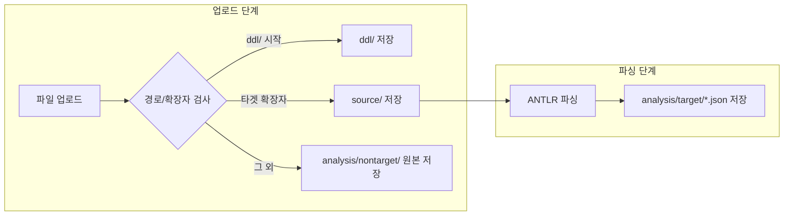

## 타겟/비타겟 파일 저장 구조 정리

이 문서는 `target` 언어와 **비타겟 언어 파일**을 어떻게 저장하고, 파싱 결과를 어디에 생성하는지 정리한 문서입니다.

### 1. 전체 디렉터리 구조

```text
data/
├── source/                ← 타겟 언어 파일 (업로드 시)
├── ddl/                   ← DDL 파일 (원본 폴더 구조 유지)
└── analysis/
    ├── target/            ← 타겟 언어 파싱 결과 JSON (파싱 시)
    └── nontarget/         ← 비타겟 파일 원본 (업로드 시)
```

- **타겟 언어 파일**: `source/` 아래에 원본 경로 그대로 저장
- **비타겟 파일**: `analysis/nontarget/` 아래에 원본 경로 그대로 저장
- **파싱 결과(JSON)**: `analysis/target/` 아래에 타겟 파일과 동일한 상대 경로로 저장

### 2. 타겟 언어별 확장자

`TargetParserStrategy` 에 `getTargetExtensions()` 메서드를 추가해서, 각 타겟 언어별 확장자를 정의했습니다.

- **Java (`JavaParserStrategy`)**
  - 확장자: `.java`
- **Oracle PL/SQL (`PlSqlParserStrategy`)**
  - 확장자: `.sql`, `.pks`, `.pkb`, `.prc`, `.fnc`
- **PostgreSQL (`PostgreSqlParserStrategy`)**
  - 확장자: `.sql`

### 3. 업로드 단계 동작 (`POST /antlr/fileUpload`)

업로드 시 `TargetParserStrategy.upload(MultipartFile[] files)` 에서 내부적으로 다음과 같이 동작합니다.

- `FileParserService.uploadFiles(files, targetExtensions)` 호출
- 파일별로 **경로와 확장자**를 기준으로 분기

#### 3.1 분기 규칙

- **DDL 파일**
  - 조건: 업로드된 파일의 상대 경로가 `ddl/` 로 시작
  - 저장 위치: `data/ddl/{상대경로에서 'ddl/' 제거}`
- **타겟 언어 파일**
  - 조건: 파일 확장자가 `targetExtensions` 에 포함
  - 저장 위치: `data/source/{상대경로}`
- **비타겟 파일**
  - 조건: 위 두 조건에 모두 해당하지 않는 나머지 파일
  - 저장 위치: `data/analysis/nontarget/{상대경로}`

#### 3.2 업로드 결과 맵 구조

`FileParserService.uploadFiles()` 반환값:

- `files` : 타겟 언어 파일 목록 (`source/` 에 저장된 파일 내용 포함)
- `ddlFiles` : DDL 파일 목록 (`ddl/` 에 저장된 파일 내용 포함)
- `nontargetFiles` : 비타겟 파일 목록 (`analysis/nontarget/` 에 저장된 파일 내용 포함)

### 4. 파싱 단계 동작 (`POST /antlr/parsing`)

파싱 단계에서는 **오직 타겟 언어 파일만** 대상으로 ANTLR 파싱을 수행합니다.

1. `source/` 하위의 모든 파일을 순회
2. 각 파일에 대해 `TargetParserStrategy.parseFileWithStream(file, outputPath, tracker)` 호출
3. `outputPath` 는 `analysis/target/` 기준으로 계산

#### 4.1 파싱 결과 경로

- 입력 파일: `data/source/{상대경로}.<ext>`
- 결과 파일: `data/analysis/target/{상대경로}.json`

예시 (Java 타겟):

- 입력: `data/source/com/example/UserService.java`
- 결과: `data/analysis/target/com/example/UserService.json`

### 5. 비타겟 파일 처리 요약

- 비타겟 파일은 **업로드 시점에만** 처리하며, **파싱 대상이 아님**
- 원본 그대로 `analysis/nontarget/` 에 저장되어, 이후 도구에서 필요 시 참조 가능
- 디렉터리 구조는 업로드된 상대 경로를 그대로 유지

예시:

- 업로드 파일 경로: `config/app.xml`
- 저장 경로: `data/analysis/nontarget/config/app.xml`

### 6. 흐름 요약 (Mermaid)




